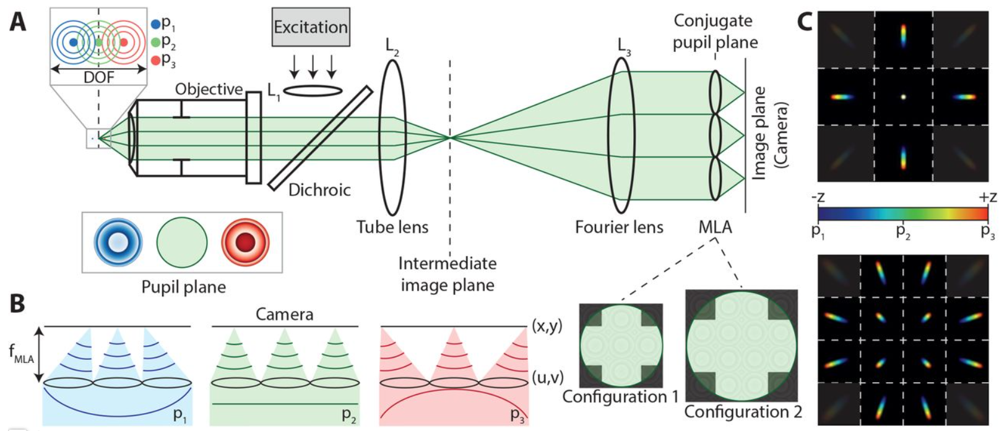

```{r setup, include=FALSE}
knitr::opts_chunk$set(echo = FALSE)
library(knitr)
library(twitterwidget)
```

The first edition of the paper round up appears to be heavily fluorophore-based. Perhaps this is a sign of things to come but 

## New, brighter, mEOS3.2 variants

mMaple3 and mEOS4.2 are currently the go to green/red photo-convertible fluorescent proteins for fixed cell SMLM. However, for live SMLM perhaps these new variants developed by Marathe et al now edge it. The newly developed mEosBrite variants that are reported to have higher quantum yield, and reduced cyto-toxicity compared to the original mEos3.2.  

https://doi.org/10.1007/s10895-020-02537-8
<br>
<br>

## sandSTORM

Continuing the theme of improvements to SMLM probes, sandSTORM is a SMLM method similar to dSTORM that uses self-activated photo-blinking of Nitrogen Vacancy (NV) centers conjugated to nano-sized diamonds to temporally separate overlapping single molecules. Blinking of the photo-luminescence is thought to occur as the charge state of the NV centres changes as a result of photo-ionization when in the presence of sufficient electrolytes, and continuous illumination.

In comparison to traditional fluorophores used for dSTORM, such as Alexa 647, the NV- centers were reported to have higher quantum yield, limited photo-bleaching, and low cyto-toxicity. In addition, as the NV centres switch between on and off states at high frequencies than the blinking of Alexa 647, experimenters will be able to capture the required 10,000s of images over a shorter period (perhaps even facilitating live imaging). What is particularly nice is that the NV centres do not require redox buffers, and work in physiological solutions.

Narayanasamy et al., illuminated their sample with a 200 mW 561 nm laser, and used a bandpass emission filter of 570 nm to 640, which they report provided the best spectrum of NVo and NV- emission overlap. The ability to use lower laser powers is particularly attractive as SMLM systems tend to use high-powered lasers that are generally more unstable, or implement magnification lenses to concentrate the laser power, thereby reducing the field of view that is illuminated. 

One observation on twitter by Matt Rasband was that the nanodiamonds used were relatively large (50 nm), which would limit the resolution. Izzy Jayasinghe, the last author on the pre-print, responded to say that they tried smaller NVs (5 nm), which they found to be less optimal for imaging as the smaller surface area meant fewer photo-luminescent NVs were available, and they exhibited a lower conjugation efficiency.


```{r twitter, layout="l-body"}

twitterwidget('1263448341188313093')

```

<br>
<br>
<br>
<br>
<br>

Approvingly, the paper uses an old Nikon TE2000, and the Nikon 1.49NA 100X TIRF lens. Would be interesting to try on the N-STORM 5.0 with the more stable Ti2 and [Perfect focus system](https://www.microscopyu.com/tutorials/the-nikon-perfect-focus-system-pfs).

https://www.biorxiv.org/content/10.1101/2020.05.20.106716v1.full.pdf+html

Let's hope it catches on like the original sandstorm https://www.youtube.com/watch?v=y6120QOlsfU
<br>
<br>


## Single Molecule Light Field Microscopy (LFM)

3D single molecule localisation microscopy (SMLM) is traditionally achieved through the addition of a cylindrical lens into the light path, which adds an astigmatism to the single molecule point spread function. When calibrated, the extent of the astigmatism can provide information on the molecule's z-position. Since its initial description in 2006, other methods including [multi-plane imaging](https://doi.org/10.1073/pnas.0810636105),  [double-helix PSF](https://doi.org/10.1073/pnas.0900245106), and [2-photon activation by temporal focusing](https://www.nature.com/articles/nmeth.1211), have also been developed for 3D SMLM.

Sims et al., describe a different optical arrangement to achieve 3D SMLM. Fourier LFM is achieved by positioning a refractive micro-lens array in an intermediate image plane in front of the camera (image below). Instead of a the typical single image, the micro-lenses produces many views of the same image within circular sub-images. In addition to the standard x y information, each the circular sub-images provides different angular sampling due to the asymmetric curvature of emission light caused by the micro-lenses. The angular information from all circular sub-images can be used to locate the z-position of the single molecules.  
<br>

```{r, layout="l-body-outset"}



```

<br>

The main advantage of using a micro-lens array is the larger z-range compared to a traditional cylindrical lens system, ~ 6 $\mu m$ compared to ~ 0.8 $\mu m$, respectively. Though note many SMLM systems offer the ability to overlap their 0.8 $\mu m$ z-ranges using a piezo device for instance. Thus, though it is possible to get a 5 um range with a cylindrical lens system, it will take more time that the technique described in this pre-print.  

Over the extended z-range, Sims et al., report similar xy resolution to existing STORM and PALM techniques (~ 20 nm). What appears nice is that their technique is compatible with existing Gaussian detection algorithms that have been used and refined. In addition, the post-acquisition aberration correction that is essential in most 3D SMLM techniques requires no phase retrieval or z-dependent calibration scans, which can be time consuming.  

https://doi.org/10.1101/2020.05.20.104802


## post-SynTagMa and pre-SynTagMa 


Perez-Alvarez et al. report genetically encoded calcium indicators that are localised to pre- and post-synaptic structures of neurons, respectively. When exposed to 395–405 nm illumination these probes are primed to permanently change from green to red emitted fluorescence when they bind calcium. This gives the experimenter an indication of neurotransmitter release (indirectly), and post-synaptic activation. Employing a blue-light dependent photo-conversion provides a clever way to get around the issue of the temporal and XYZ spatial resolution required to map large areas of synaptic activity. 


https://doi.org/10.1038/s41467-020-16315-4

<br>
<br>

## 3D light field voltage imaging

Voltage imaging is still an emerging technique with the continuing improvement of genetically-encoded voltage indicators (GEVIs). This pre-print by Quicke et al. addresses one of the major hurdles in voltage imaging, namely when voltage changes occur so quickly how do you capture the corresponding changes in fluorescence from structures located in, or across, different z-planes within your field of view?  

Here Quicke et al. used a relatively old GEVI, VSFP-Butterfly 1.2, developed by Thomas Knopfel's lab. They imaged VSP in brain slices using a Light field microscope (LFM). As mentioned above, this is essentially a wide-field system with micro-lenses in the intermediate image plane to disperse the angular components of the collected image, which can then be used to reconstruct objects’ z-position. Thus, they imaged VSP at a range of z-positions simultaneously with a single camera image. Very nice.

In this paper the objects were neuronal dendrites that weave in and out of z-planes, and propagate changes in voltage in the order of 1 $\mu m$ per $\mu s$ passively to and from the neuronal cell soma. Note, whilst LFM provides a dramatic improvement in z sampling, advances still need to made in camera technology to capture such fast voltage changes. Currently, even the fastest sCMOS cameras have to be severely cropped in FOV to achieve the nyqusit sampling rates equivalent to traditional pipette-based electrophysiological techniques. 

https://www.biorxiv.org/content/10.1101/2020.05.22.108191v1.full.pdf+html


## msGFP2: A photostable monomeric superfolder GFP

There a few issues with GFP. Firstly it has a weak tendency to dimerize, which can cause artefactual clustering of tagged proteins. Secondly, GFP can mis-fold to form non-fluorescent aggregates. Valbuena et al. have designed msGFP2 that is both monomeric, and 'super-folded', thereby circumventing the aforementioned issues, respectively. In addition msGFP2 is reported to achieve similar rates of photo-bleaching exhibited by EGFP. Finally, the authors added alternative N- and C-terminal peptides into msGFP2 to reduce cyto-toxicity. If I was being a greedy reviewer I may have wanted a comparison of its cyto-toxicity and aggregate formation to mNeonGreen. 

https://www.biorxiv.org/content/10.1101/811588v1.full  


## Live-cell imaging in the era of too many microscopes

A brief primer providing a guide to which microscope biologists should choose in what is a bewildering world of acronyms, and ever-advancing techniques. Figure 1 provides a reminder of the classic 'pyramid of frustration' or perhaps the 'pyramid of compromise' is a more glass half full way of looking at it. Handily, the review gives recent examples of what biological objects have been imaged with super-resolution, structured-illumination, light sheet, and atomic force microscopy.  

It's by no means an exhaustive comparison of all available techniques, and gives no detail on non-commercialised advances, but provides researchers with an introduction to the current state of advanced microscopy, and where they can find links to relevant papers.  


https://doi.org/10.1016/j.ceb.2020.04.008


