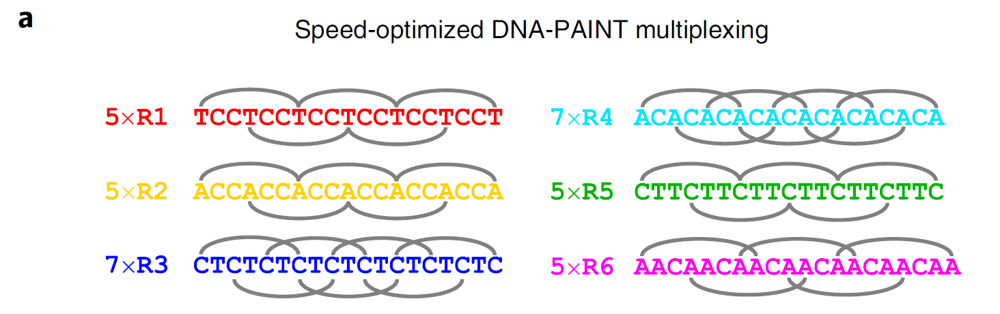

```{r setup, include=FALSE}
knitr::opts_chunk$set(echo = FALSE)
```

## SIMPLER estimation of single molecule z location 

### https://www.biorxiv.org/content/10.1101/693994v2.full.pdf

Supercritical Illumination Microscopy Photometric z-Localization with Enhanced Resolution (SIMPLER) estimates the z-position of single molecules illuminated over a TIRF field using just the intensity of emitted single molecule fluorescence. 

Szalai et al., were able to achieve this by creating a model of F(z); the fluorescence intensity of single emitters over a range of 250 $\mu m$ from the coverslip. The model takes into consideration the exponential decay of the TIRF illumination field, optical scattering, and the angular emission of single emitters based on their z-position and objective NA.  

The equation is below:

$$
\hat{z} = d_F \times ln\frac{\alpha_F}{\hat{N}/\hat{N_0} -(1-\alpha F)}
$$
Where:

* $\hat{z}$ = the estimated z-position.
* $\hat{N}$ = the number of photons from a single molecule blink integrated over its full emission.
* $\hat{N_0}$ = the number of photons emitted from single molecules that are located at the coverslip (z = 0), which is empirically measured for each experiment.
* $\alpha_F$ = the background constant calculated specifically for each microscope setup.
* $d_F$ = the exponential decay of illumination intensity over the TIRF field specific to microscope setup.

$$
d = \frac{\lambda_0}{\frac{4\pi}{(n_i^2 sin^2(\theta_i) - n_s^2)^\frac{1}{2}}}  
$$

Where:

* $\lambda$ = wavelength of illumination (nm).
* $n_i$ = refractive index of the medium of incidence.
* $n_s$ = refraction index of the medium the sample is within.
* $\theta$ = TIRF angle of incidence set for acquisition.   

<br>
<br>

$\hat{N}_0$ can be calculated by imaging a number of fluorophores located at the coverslip, and averaging their fluorescence emission integrated over a single blink. The authors point out that it is essential to collect enough frames either side of the blink to make sure you have captured the entire fluorescence emission. They also recommend to intentionally deposit the fluorophore-conjugated antibodies to be used in the experiment onto the coverslip, and determine their average $\hat{N}$ under experimental conditions.   

One caveat to bear in mind is that laser illumination is rarely perfectly uniform (even with inverse ND filters in position). As such $\hat{N}_0$ in the centre of the illumination maybe different to that at the edge of the illumination. The pre-print suggests to use a flat-field normalisation for $\hat{N}_0$ using using local background levels as a proxy of local illumination intensity. In practice that would involve imaging a solution of fluorophore (diluted Alexa 647 dye for example) with the same imaging conditions as the experiment (incident TIRF angle, laser wavelength and power, etc).

For $\alpha_F$ and $d_F$ parameters that need determined for each experimental condition, the authors provide a Matlab routine that provides estimates depending on user defined inputs.

The benefits of the SIMPLER system over traditional cylindrical lens is the avoidance of lengthy 3D calibrations, although the fluorescence intensity of single molecules located at the coverslip is still required for each imaging experiment, as is the flat-field normalisation, which may change from experiment to experiment. It will be interesting to compare the two methods. Szalai et al., suggest the SIMPLER method achieves higher z-resolution than the cylindrical lens system, and does not require axial drift corrections.  

The last author also provides a nice twitter post about what you need to implement SIMPLER: 

```{r twitter 2, layout="l-body"}

twitterwidget::twitterwidget('1270792881234685960')

```
<br>
<br>
<br>
<br>
<br>
<br>
<br>
<br>
<br>
<br>
<br>
<br>


## 100 fold faster DNA-PAINT


### https://www.nature.com/articles/s41592-020-0869-x

The Jungman lab have been at it again, this time addressing one of the major disadvantages of DNA-PAINT, namely the long acquisition times required due to the relatively slow hybridization kinetics of the docking and imager sequence pairs.

In their paper, Schwartz and Jungman point out that 10 fold increases in speed have already been achieved over traditional exchange DNA-PAINT through [optimising sequence design and buffer conditions](https://www.nature.com/articles/s41592-019-0584-7), and/or combining DNA-PAINT imager strands with [Argonaute proteins](https://pubs.acs.org/doi/10.1021/acs.nanolett.9b04277). 

The premise for their described technological improvement is that the speed of hybridization increases linearly with the number of binding sites on the imager strand. However, making the imager strand too large can increase non-specific binding, and reduce resolution. To solve this, Schwartz and Jungman created concatenated DNA sequences, where the same sequence appears multiple times in short sequences. They report an impressive resolution of 20 nm after just 5 minutes of imaging, and they also show a resolution of 5 nm was possible when using a low concentration of imager strands, though I could not find how long this took.     

Building on the increase in speed, they created 6 different concatenated imager strands (Figure 1), and by exchanging the perfusion were able to build up an image of 6 different targets within 30 minutes. I would think that this would require a near instantaneous exchange of perfusion, and perhaps in reality would depend a lot on the volume of media the sample is sittin in, and the speed of perfusion pump for equilibirum to be reached.

```{r, fig.cap =  "6 different concatenated imager strands with multiple bindnig sites for fast multiplexed exchange DNA-PAINT imaging", layout="l-body-outset"}



```

They mostly imaged Cy3B on a Nikon Ti2 with PFS and a 100x 1.49 NA TIRF objective. Images were captured on an ANdor Zyla mostly at a frame rate of 100ms with 2x2 binning for 130nm pixel sizes. 


## Combinnig blinknig fluorophores with SOFI


### https://doi.org/10.1021/acsnano.0c04602

Super-resolution optical fluctuation imaging (SOFI) applies a cumulant function to each pixel of a time-series of 100s-1000s of fluctuating fluorescence images. The resulting image is formed from pixels that display values from the integration of the cumulant function over time. Improvements in resolution over wide-field are dependent on the number of orders of the cumulant function.

SOFI has advantages over SMLM in that it can tolerate higher labelling densities, it does not require specific buffers or sample preparation, and due to its inerrant optical sectioning, automatically removes background (or non-fluctuating signal). A more detailed introduction into SOFI can be found on the [Photometrics website](https://www.photometrics.com/learn/super-resolution-microscopy/super-resolution-optical-fluctuation-imaging-sofi) 

A number of fluorophores have been tested with SOFI, but few have reported cumulant orders of over 3. By using Abberior FLIP 565, Grußmyer et al., took advantage of its spontaneous blinking behaviour to compute crosscumulants with 6 orders. Imaging microtubules in fixed COS-7 cells, they reported resolutions of between 50—60 nm in 2D after deconvolution. In addition, they report that the rhodamine-based Abberior FLIP 565 dye required low illumination intensities (0.17 kW cm-2 @ 561nm), and exhibited relatively low photo-bleaching. 


## Nanobodies and Affimers for super-resolution imaging 


### https://doi.org/10.1091/mbc.E18-11-0694

The premise for this [review](https://www.molbiolcell.org/doi/full/10.1091/mbc.E18-11-0694?url_ver=Z39.88-2003&rfr_id=ori%3Arid%3Acrossref.org&rfr_dat=cr_pub++0pubmed&) from Carrington et al, is that antibodies, which are normally used for super-resolution imaging introduce an inherent linkage error. Their physical size artificially distorts the position of the fluorophore from its target protein between ~10 nm for directly conjugated primary antibodies, and ~20 nm for primary and secondary antibody labelling strategies.  

To overcome this the authors suggest one option is to use nanobodies, antibodies found in camelids, that are many times smaller than traditional antibodies and have the potential to reduce the linkage error. One approach the review describes is from [Pleiner et al., 2015](https://elifesciences.org/articles/11349]) who report reduced background and increased epitope recognition when incorporating cysteines into the nanobodies.

The second option the authors discuss are Affimers, which are proteins that contain two peptide loops, and an N-terminal sequences which are randomised to bind to desired target proteins similar to antiboides. At 3 nm they are even smaller than nanobodies, and in theory offer reduced linkage error, and also greater cellular penetration than traditional antibodies. Affimers have been used by the Peckham lab to image both [tubulin](https://elifesciences.org/articles/24903) and [F-actin](https://onlinelibrary.wiley.com/doi/abs/10.1002/anie.201804020).


## DeepSTORM 3D localisations of overlapping PSFs

### https://doi.org/10.1038/s41592-020-0853-5

SMLM is not very amenable to fast acquisition times, especially those required for live imaging. The need to separate single emitters in time and space means acquisitions for a single image are typically in the range of 20-30 minutes and require fluorophores that blink with specific characteristics. Nehme et al., combine hardware and software advances to improve the ability to detect overlapping single molecules to such a degree that allows for 10Hz live acquisition of particular samples using non-blinking fluorophores over a large axial range.

By creating a 4f system at the intermediate image plane, and placing a phase mask at the fourier plane between the two lenses, Nehme et al., deformed the PSF into what is known as a Tetrapod PSF. The advantage of the Tetrapod PSF is that it spans an axial range of 4 $\mu m$ (typical ranges are 0.8 $\mu m$), and by modulating the phase mask provides a more optimal pattern to be identified by subsequent image analysis.

To decipher the 3D position of the tetrapod PSFs, simulated 3D emitter positions were passed through a computational model of the phase mask to generate an image of the PSFs, and then a neural network was trained using these images to recover the known simulated emitter positions, and compared against the original simulated tetrapod PSFs. The result was a neural network that was able to recover many overlapping PSFs over a large volume, to a degree that negated the need for blinking fluorophores that can be separated in time.   

As a proof of principle they image and track non-blinking DsRed-labelled teloomers in live mouse embryonic fibroblast at a frame rate of 10 Hz over 50 s. 

I haven't had time to digest the lengthy supplementary materials as yet, but there you will find details on how dense the single emitters can be before the system loses resolution, and also what resolution was achieved.


## Acknowledgments {.appendix}


The image in the entry on 100-fold faster DNA-PAINT was taken from the [paper](https://www.nature.com/articles/s41592-020-0869-x) it describes by Schwartz and Jungman. 


