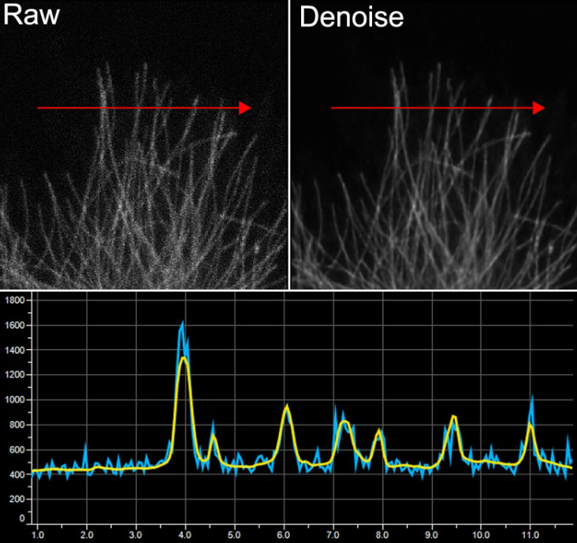

```{r setup, include=FALSE}

knitr::opts_chunk$set(echo = FALSE)

```

As with most aspects of life, deep-learning neuronal networks are well and truely deployed within microscopy. Nikon offers powerful and simple tools to improve your imaging. 

## Denoise.<span style="color:red">ai</span>

Denoise.ai is a newly released, pre-trained, convoluted neural network that comes as free with the lastest versions of NIS-Elements AR and NIS-Elements C. The later software is used to control the Nikon point scanning confocal (A1R HD25), and the Nikon multi-photon (A1R MP).  

The denoise.ai neural network has already been trained on 100,000’s of resonant scanner images to be able to distinguish signal, and remove shot noise from images, an inherrant source of noise resulting from the sampling and digitisation of photons by the detector.

Unlike traiditona;y low pass filter methods of image de-noising, denoise.ai does not average pixels over a kernal so there is no loss in resolution when the noise is removed. Furthermore, microscopists can be re-assured that their signal is not 

cc

```{r, layout="l-body-outset"}



```

Usually with a point scanning confocal the way to improve your image and remove noise is to average or Integrate over a higher number of line scans. The removal of shot noise from images using denoise.ai effectively allows you to image faster by reducing the number of line scans for equivalent signals
To noise. 

Nikon’s point scanning confocal has both resonant and galvanic scan heads. Although trained on the resonant scanner it works very well on the galvo scanner as well. As a boncus denoise.AI, when demoing the SoRa super resolution spinnng disk, we have also found the network works well on back illuminated sCMOS cameras such as the Photometrics Prime BSI.

More information can be found a the Nikon website:  

https://www.microscope.healthcare.nikon.com/products/confocal-microscopes/a1hd25-a1rhd25/nis-elements-ai

And in application note:

https://www.nature.com/articles/d42473-019-00355-6

