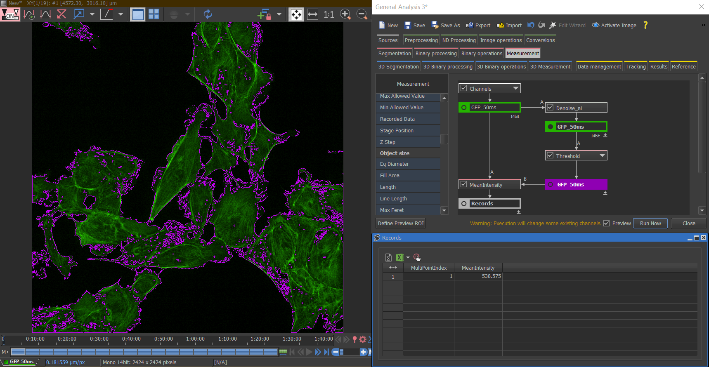

```{r setup, include=FALSE}

knitr::opts_chunk$set(echo = FALSE)

```

As with most aspects of life, deep-learning neuronal networks are well and truly deployed within microscopy. Nikon offers a simple tool to improve your imaging. 

## Denoise.<span style="color:red">ai</span>

Denoise.<span style="color:red">ai</span> is a newly released, pre-trained, convoluted neural network that comes free with the latest versions of NIS-Elements AR and NIS-Elements C. The later software is used to control the Nikon point scanning confocal ([A1R HD25](https://www.microscope.healthcare.nikon.com/products/confocal-microscopes/a1hd25-a1rhd25)), and the Nikon multi-photon ([A1R MP](https://www.microscope.healthcare.nikon.com/products/multiphoton-microscopes/a1r-hd-mp)).  

Denoise.<span style="color:red">ai</span> employs the MXNET framework pre-trained on 100,000’s of resonant scanner images in order to distinguish signal, from noise. Specifically, it removes shot noise that results from the sampling and digitisation of photons by the photon multiple tubes.

Unlike, low pass filter methods of image de-noising, Denoise.<span style="color:red">ai</span> does not average or smooth pixels over a kernel, so there is no loss in resolution when the noise is removed. Furthermore, microscopists can be re-assured that their signal has not been falsely manipulated. By acquiring a 'ground-truth' image using high line averaging (e.g. 64x), and comparing it to a low line averaged image, which Denoise.<span style="color:red">ai</span> has been applied to, users can test the effect of processing themselves. Below is an example:

```{r, fig.cap =  "Raw confocal and AI-denoised images (top), with an intensity profile line overlaid for comparison (bottom). The intensity profile of the Denoise.ai image is maintained against the original intensity, but removes the shot noise variance visible in the raw image (blue line). Image: microtubules, 60x.", layout="l-body-outset"}

knitr::include_graphics("images/denoiseAI_example.PNG")

```

For those who prefer not to take measurements from any processed image, Denoise.<span style="color:red">ai</span> can still be of use for segmentation. By applying the Denoise.<span style="color:red">ai</span> to clean up the image post-acquisition, regions of interest are more easily segmented into a binary layer. The binary layer can then be over-layed on the raw, unprocessed, image to take measurements. An example is shown below using General analysis 3 in NIS-Elements:

```{r, fig.cap =  "General analysis 3 pipeline showing how Denoise.ai can be implemented to improve image segmentation of raw images, here the mean intensity of GFP was measured using the binary layer attained from the denoised image", layout="l-body-outset"}



```


When imaging with a point scanning confocal, a common method to improve the image is to by remove noise by averaging or integrating over a high number of line scans. The removal of shot noise from images using Denoise.<span style="color:red">ai</span> effectively allows the user to image faster by reducing the number of line scans to achieve equivalent signal-to-noise. We recommend that users empirically determine the line averaging they require with denoise.ai turned on, image with denoise.ai turned off, and apply the neural network post-acquisition. In that way the user retains the raw, unprocessed image if they needed to return to it. This has obvious advantages, namely it facilitates a higher throughput and speed of imaging, reduces the cost of using imaging facility microscopes, and by reducing the number of line scans required, reduces the chances of photo-bleaching. Moreover, for live imaging, Denoise.<span style="color:red">ai</span> allows users to achieve higher frame rates. 


Nikon’s point scanning confocal has both resonant and galvanic scan heads. Although trained on the resonant scanner, Denoise.<span style="color:red">ai</span> also works very well on the galvo scanner. As an unforeseen bonus, when demoing the SoRa super resolution spinning disk, we have also found the network works well on back illuminated sCMOS cameras such as the Photometrics Prime BSI when there is sufficient signal to noise in the raw image. Given the common usage of spinning disks for live imaging, Denoise.<span style="color:red">ai</span> could potentially be very 

More information can be found on the [Nikon website](https://www.microscope.healthcare.nikon.com/products/confocal-microscopes/a1hd25-a1rhd25/nis-elements-ai), and within an [application note](https://www.nature.com/articles/d42473-019-00355-6)


## Acknowledgments {.appendix}

Thanks to Christelle Rosazza at Nikon for suggesting Denoise.<span style="color:red">ai</span> can be used effectively on the Prime BSI.

