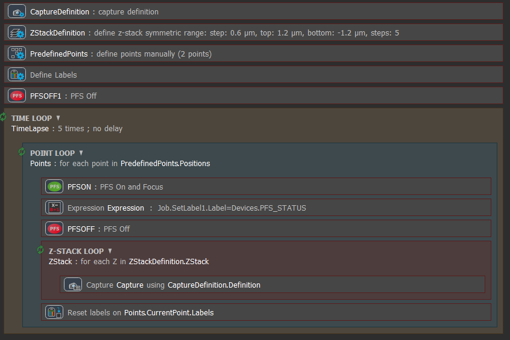
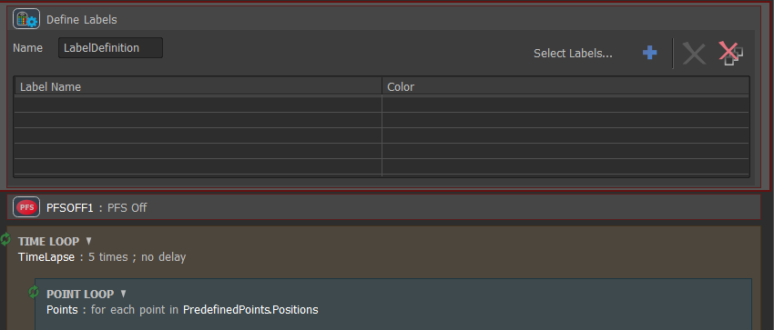
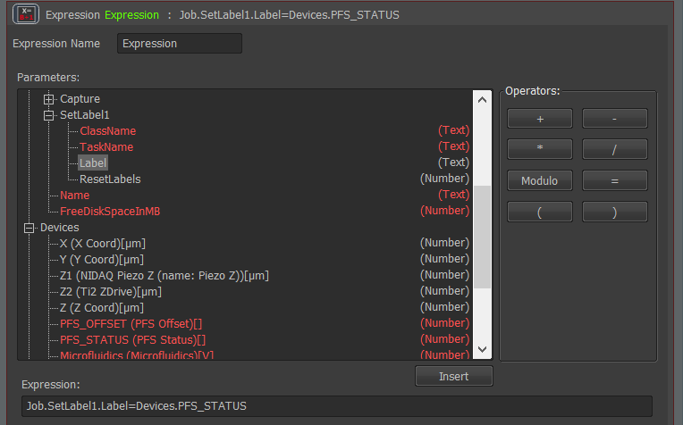
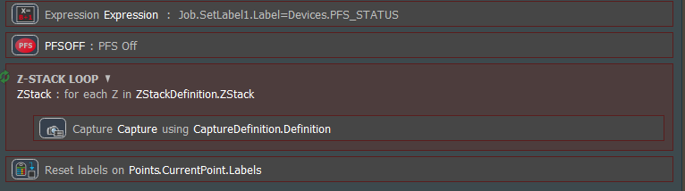
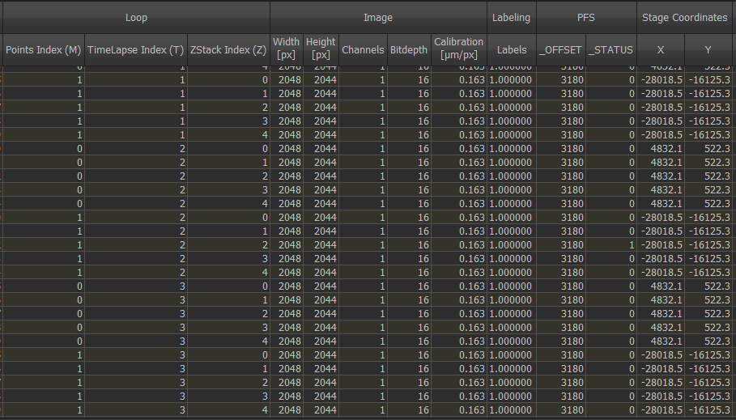

```{r setup, include=FALSE}
knitr::opts_chunk$set(echo = FALSE)
```

The example below describes an experiment where the user wishes to know the Perfect Focus System (PFS) status before a Z-stack is taken. Typically NIS-Elements records the PFS status in the meta data as standard, however for z-stacks the PFS needs to be turned off, and so the PFS status is 0 (off), where really we would like to know the status of the PFS before the z-stack is initialised, for example at each time point, multi point positon.


## 1. Define the imaging loops required

In this example we want to image a z-stack at multiple stage positions, at multiple time points.

```{r, fig.cap =  "First define the acquisition loops required", layout="l-body-outset"}



```

## 2. Define label

Outside the acquisition loops, drag in a define labels command, it is not necessary to add any labels to this, but instead best to keep it empty.

```{r, fig.cap =  "Define labels command is necessary", layout="l-body-outset"}



```


## 3. Inside the acquisition loop create an expression to assign metadata to the label

In this example we are interested in finding the PFS status at each time point and at each stage position. To assign the PFS status to the empty label we defined before, we need to build up the expression to make the 'Set Labels' parameter  to equal the 'PFS device status'. Selecting the appropriate parameter and using the insert button, and then using the operator buttons is the easiest way to build up the expression.

```{r, fig.cap =  "Assigning device status to expression set label parameter", layout="l-body-outset"}



```


## 4. Reset the label

Following the acquisition of the images it is necessary to reset the label to its original empty form at the end of each acquisition loop so it can be repopulated at the start of the next loop. This means in this case we insert a 'Assign labels' command into the end of the point loop and check the 'Rest' check box. This will act to reset the parameter that is called in the expression.

```{r, fig.cap =  "It is necessary to reset the labels at the end of each loop", layout="l-body-outset"}



```

## 5. Metadata shows PFS device setting

The metadata will then appear in the JOBs viewer grid under the column 'Labels'. Here you can clearly see that the PFS status at each multi-point before the z-stack was taken was 1 meaning the PFS was in range and focused on the sample. The 0 value in the PFS column is because PFS was turned off during the z-stack acquisition.


```{r, fig.cap =  "Dynamically altered metadata can be viewed under the labels column in the Jobs Results Grid view", layout="l-body-outset"}



```


This data can be exported to an excel, csv, or txt file.

\

Here we discuss the PFS status, but the status of any device on the microscope can be recorded. Alternatively, you may be interested in recording the temperature or including real time analysis into the JOB run so that they appear in the meta data. Lots of possibilities.


