```{r setup, include=FALSE}
knitr::opts_chunk$set(echo = FALSE)
```

The inspiration for writing this post came from a Ti2 user who wanted to image multiple positions in a bespoke well plate over time with z-stacks. Crucially, they wanted to be able to pause the acquisition to add reagents. Below is how you would implement this in a JOB using an If statement, parameters, the question task, and custom metadata.


## JOB definition

When selecting 'New' within the JOBs explorer you will encounter an empty JOB Definition window. The leftmost palette lists all the tasks/functions available, displayed as either an icon, or an icon + description. Expert mode button switches between the simple tasks, and all tasks. 

To build up a JOB, tasks are added sequentially to the main window, by dragging their icons across from the list. Every task has different parameters that can be revealed by double-clicking on the task caption. 

For the current JOB we generated the following sequence of tasks:


```{r, fig.cap =  "Overall JOB definition", layout="l-body-outset"}

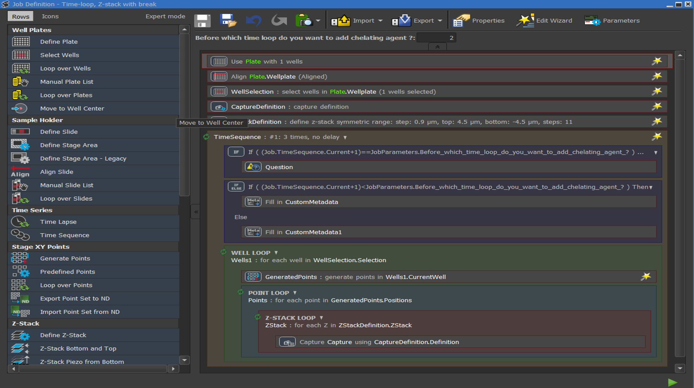

```

## Custom wellplate

The 'Define Well-plate' (Figure 1) task allows users to input exactly the well-plate they are imaging from a database. If users have made their own plate then they are able to encode this into the JOB by selecting 'Custom plate' and specifying the relevant dimensions (Figure 2). Once saved, the custom well-plate can be reused.

After the well-plate is selected, the user needs to align the plate to the stage, and to select the wells within the plate that they want to image (Figure 1).  


```{r, fig.cap =  "Custom well plate GUI", layout="l-body-outset"}

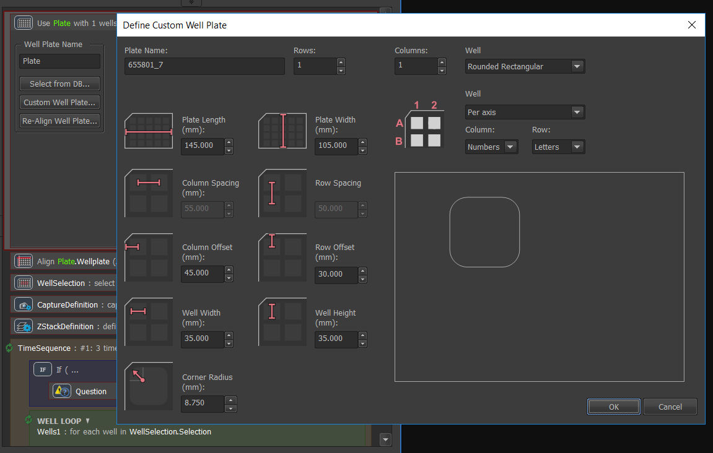

```


## Parameters

Parameters represent “conditions” for individual tasks that are dragged into the JOB pipeline. A single task can carry more than one parameter if needed. If all values of its parameters are met at the beginning of the JOB run, the task is executed. If one parameter value is different than the initial parameter selection, the task will be skipped.

To start using parameters, click the  Properties button inside Job Definition Window and check the Enable Parameters check box. Now click OK to confirm the selection and open the Job Parameters window by clicking the  Parameters button.  

The 'Add New Parameter' button adds a parameter, which can be given a name, a type (On/Off, choice from a list of options or a numeric value), and  the values it takes (Figure 3).

You are now in a position to assign parameters to specific tasks in the JOB pipeline. This can be done in the Job Definition Window by right-clicking on the desired task and choosing 'Requires parameter'.

In this example, we have not assigned the parameter to a task but used the parameter within an If statement (Figure 4), which is described in the next section.

```{r, fig.cap =  "Creating parameters that places conditions on specifcic tasks within a JOB", layout="l-body-outset"}

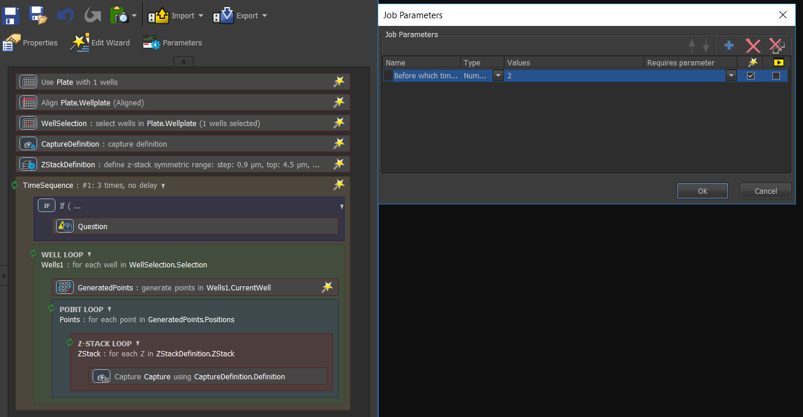

```

## IF statements

If statements allow for conditional image acquisition. If the specified conditional expression is evaluated TRUE, the contained tasks will be run. Otherwise the contained tasks are skipped. 

In the above JOB, the user will define the time loop in which they wish to pause the acquisition and add the reagents to their sample. To include this in the JOB, an If Task is dragged within the Time sequence loop (Figure 5). Double clicking on the IF task allows us to specify the condition:

Here we have chosen the command: 

- (Job.TimeSequence.Current+1)<JobParameters.Before_which_time_loop_do_you_want_to_add_chelating_agent_? 

Meaning if the current time loop is equal to the parameter set in the wizard by the user, then the acquisition will pause, and the question 'Have you added the chelating agent? ' will be asked. The acquisition will only continue when the user presses OK. Note that since the time sequence starts from 0, we have to add a 1 to the current time sequence.


```{r, fig.cap =  "If statements ", layout="l-body-outset"}

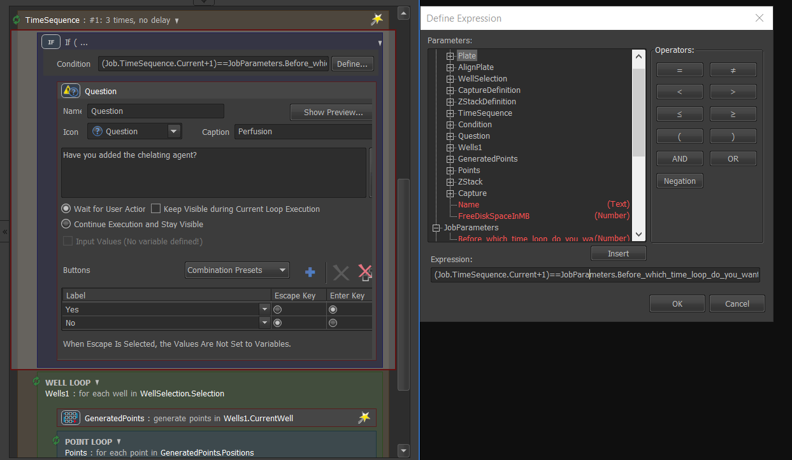

```


## Adding metadata

When analysing the results it will be useful to be able to categorise the images based on whether they were acquired before or after the addition of reagents. To do this we need to use the 'Custom metadata' task within an If Else statement. 

Firstly we need to go to JOBs > Managae Custom Metadata from the top menu, and add a Treatment Metadata in the 'Long text' format before pressing OK (Figure 6).

```{r, fig.cap =  "Manage custom metadata", layout="l-body-outset"}

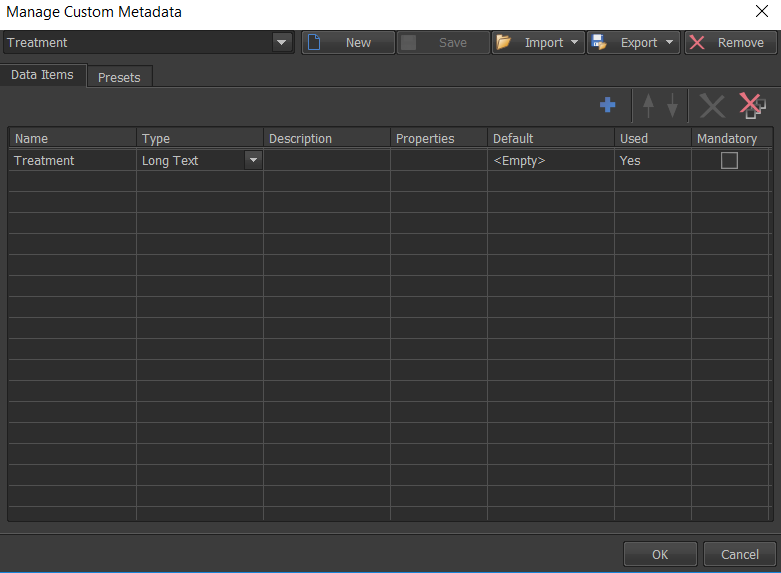

```

Then within the time sequence loop of the JOBs definition, we add an If Else statement. Here we use the same condition as the previous If statement. 

- (Job.TimeSequence.Current+1)<JobParameters.Before_which_time_loop_do_you_want_to_add_chelating_agent_? 

Within the If and else boxes we drag the 'Custom Metadata' task, checking the box for Custom metadata, and writing a relevant category to distinguish the images. In this example we wish to use 'Before treatment' and 'After treatment' to distinguish the images (Figure 7).  

```{r, fig.cap =  "Custom Metadata within an IF Else statement to distunguish images taken before or after the addition of reagents ", layout="l-body-outset"}

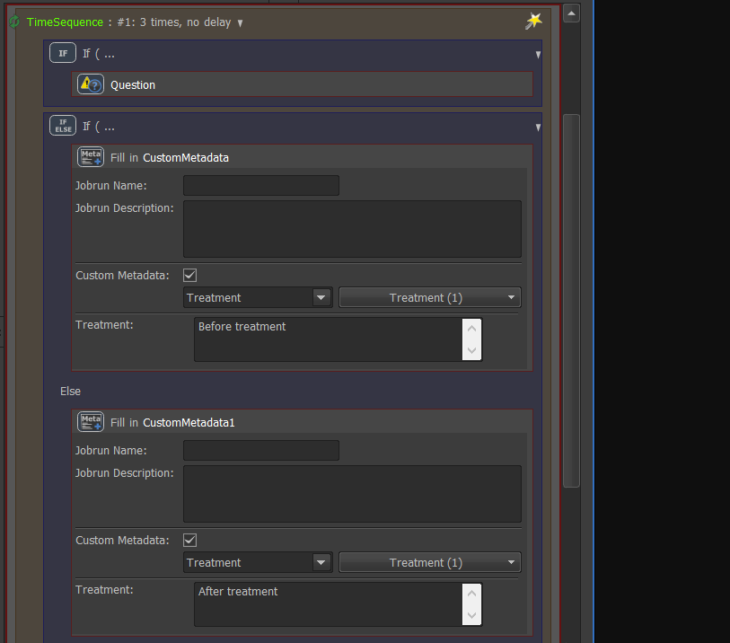

```

When the JOB is finished a column in the metadata with the title of 'Treatment' will appear, populated with the relevant text depending on when the image was acquired (Figure 8). 


```{r, fig.cap =  "Results window showing the custom Treatment column", layout="l-body-outset"}

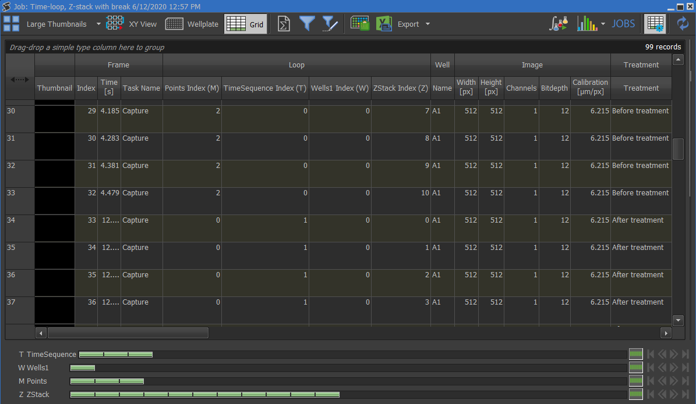

```


## Adding tasks to the Wizard

A Job is usually run multiple times to acquire data in different conditions. Generally, few parameters have to be changed between each run (e.g. length and interval of a time-lapse, well-plate metadata, like drug concentrations or labels, or even threshold intensity level).  

For this reason it is possible to mark some tasks for reviewing in a Wizard. To add a task into the wizard right-click on the task in the JOB definition window, and choose 'Put in Wizard'. A wand symbol will appear next to the task (Figure 1).

When the JOB is run, the wizard window will appear, and all steps in the wizard need to be selected and reviewed in order to run the JOB using the play button (Figure 9).

```{r, fig.cap =  "Wizardised JOB routine", layout="l-body-outset"}

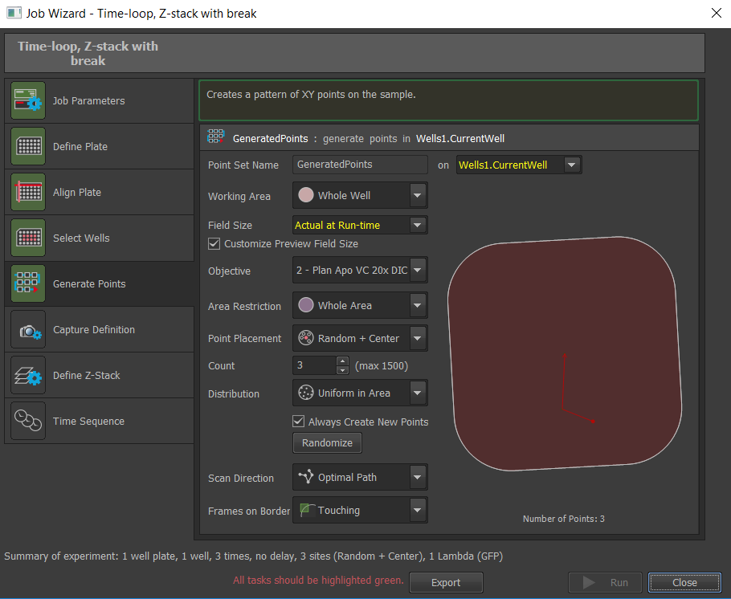

```


## Edit Wizard

It is possible to edit what the user sees in the Wizard menu. Wizard steps marked with the wand icon can be moved up and down or even linked together (using the connect and disconnect buttons). Parameters steps always have to come first. The user can re-define the text shown to explain clearly what the step is required for, and any specific instructions (Figure 10).  

```{r, fig.cap =  "How to make the wizard more bespoke to your experiment", layout="l-body-outset"}

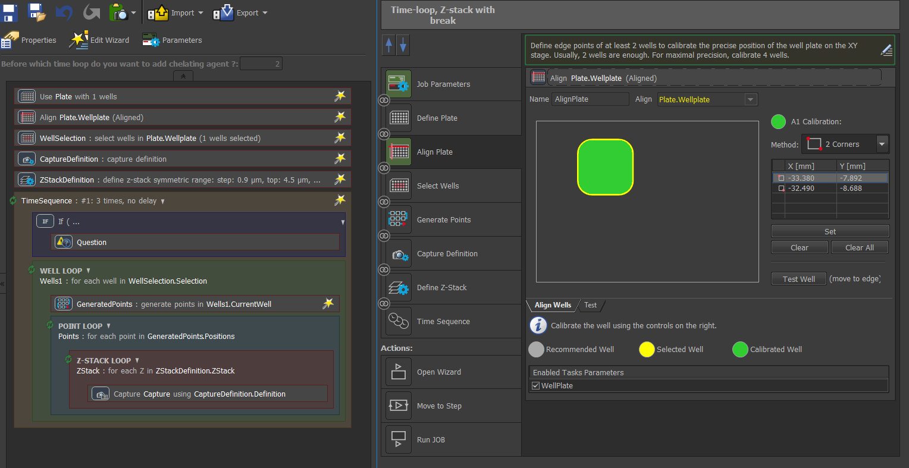

```


## Running the JOB

Once the Run Job button is selected, a window is displayed showing the progress. As with ND2 acquisition, blue rectangles representing dimensions or frames turn green when captured. The window shows the analysis results immediately during the job after the analysis is done (Figure 11).  


```{r, fig.cap =  "JOBs runtime window", layout="l-body-outset"}

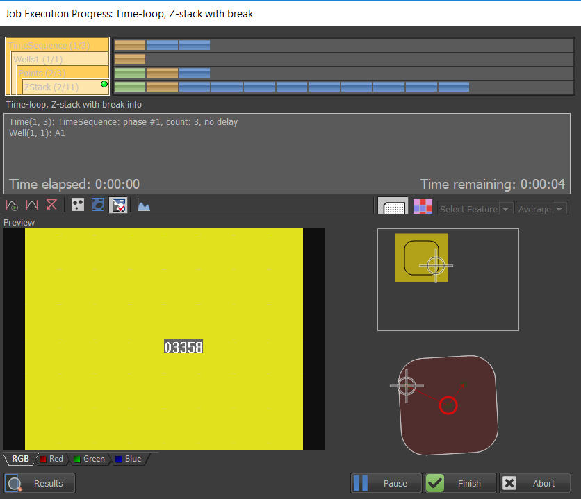

```

## User-defined pause in the acqusition

The break we added in the JOB definition to ask a question using the IF function, will appear depending on the user-defined JOB parameter of which loop to add the reagents. Once the task definition dialogue shows up, the JOB execution is paused until the OK button is pressed (Figure 12).

```{r, fig.cap =  "User needs to press Ok after adding reagents to the sample before the acqusition will continue", layout="l-body-outset"}

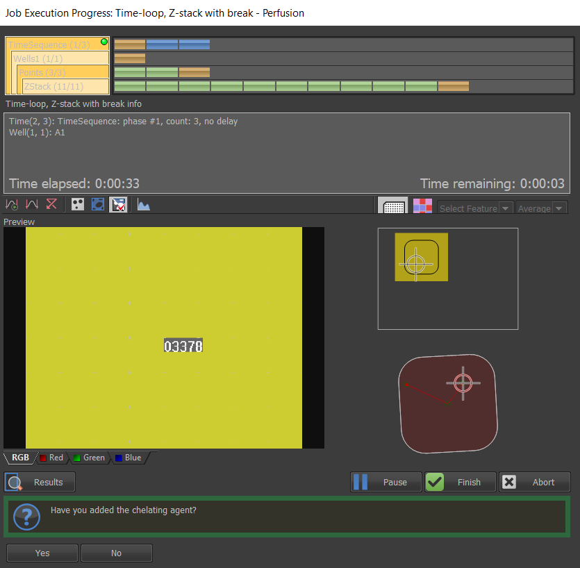

```


## Results view

Once the job run is finished, results are saved automatically within the database specified in the JOBs explorer, and the JOB results window opens (Figure 13). Images can be viewed as different sized thumbnails, within an XY map view, or as a table of their metadata. More,over the results window can filter the data based on a column, and even produce graphs.  

To open some other saved JOB results, select the particular JOB run in the JOBs Explorer and click Results. 

```{r, fig.cap =  "Results window", layout="l-body-outset"}

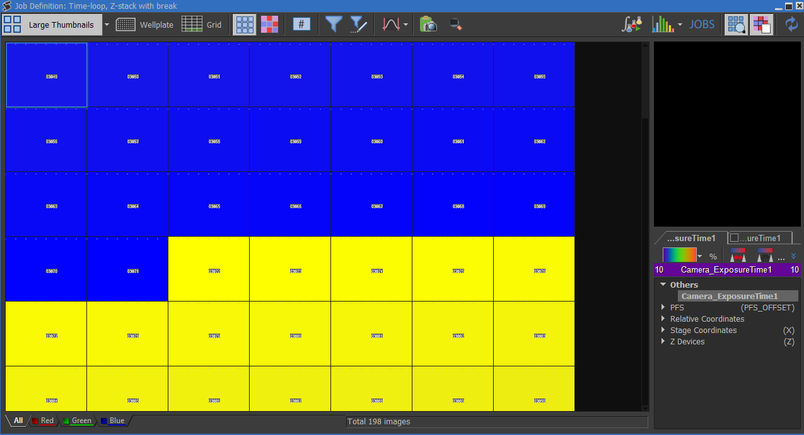

```

## Acknowledgments {.appendix}

Some sections are modified from the ever useful Help file within NIS-Elements.


