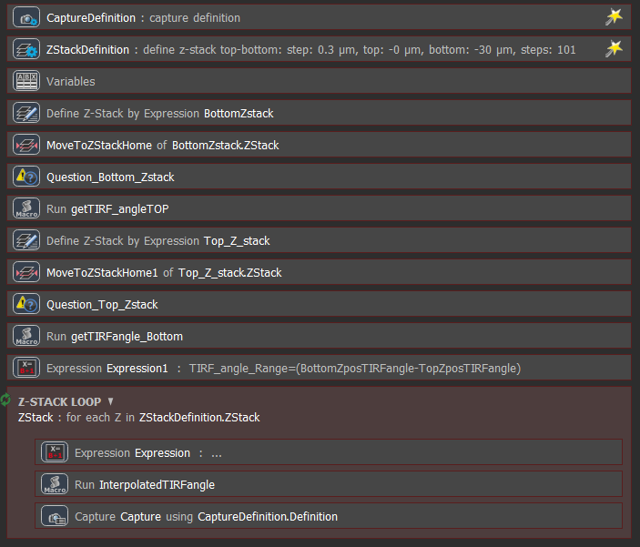
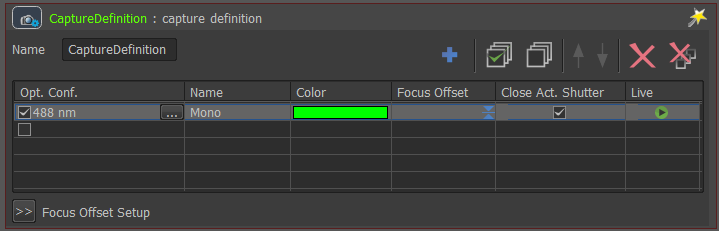
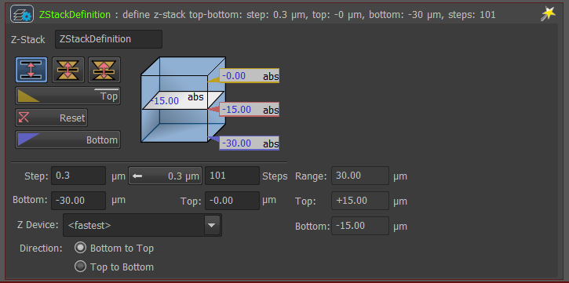
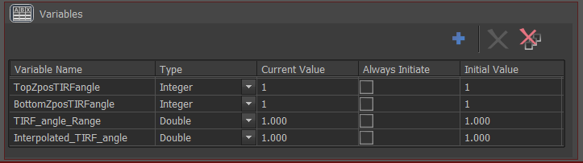
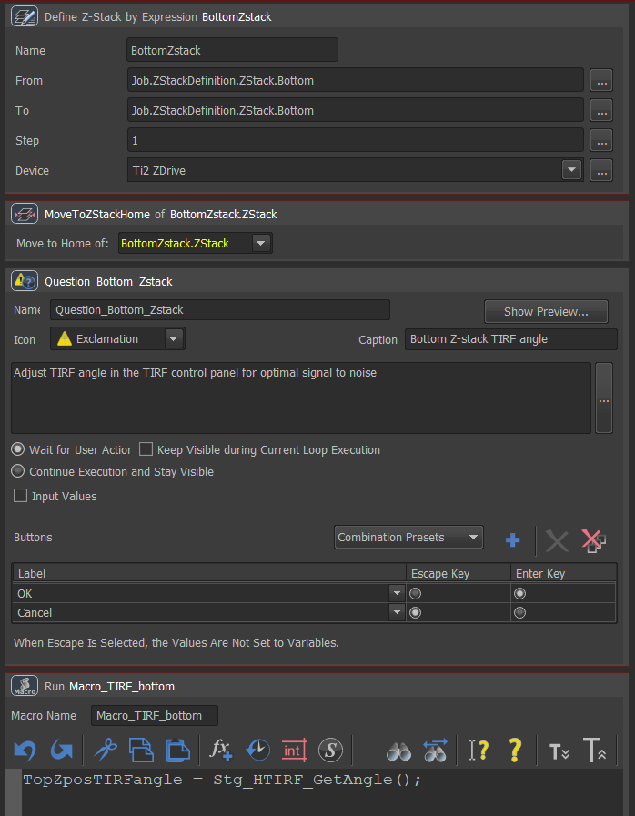
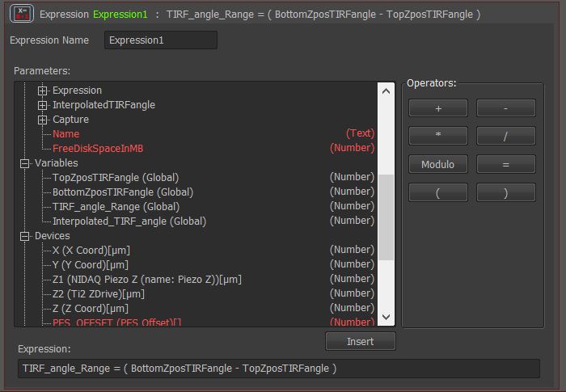
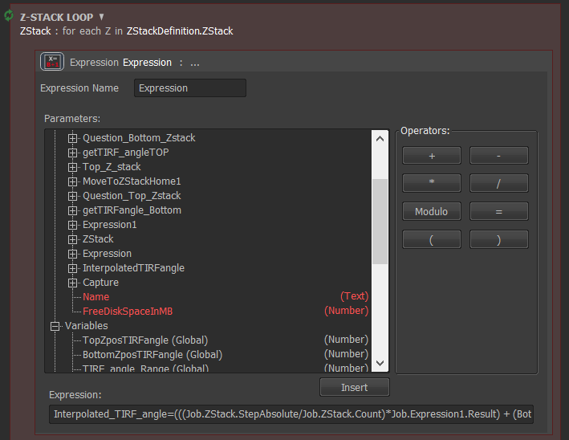
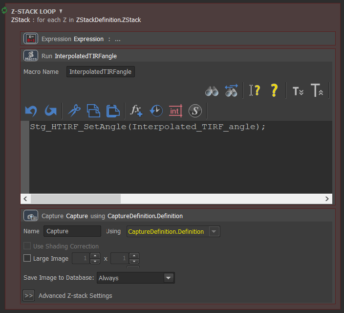

```{r setup, include=FALSE}
knitr::opts_chunk$set(echo = FALSE)
```


Acquiring Z-stack acquisitions using TIRF illumination typically benefit from adjusting the TIRF angle as the Z-stack moves away from the glass coverslip. Typically, higher TIRF angles are preferred at Z positions close to the coverslip for maximal signal-to-noise, and lower (hi/lo) TIRF angles for Z positions further away from the coverslip to extend the evernescent TIRF field. 

This acquisition requires NIS-Elements > v .... and the JOBs module. It was writted for the HTIRF or NSTORM illuminator, but could easily be tweaked for the E-TIRF illuminator.


## JOB definition

When selecting ‘New’ within the JOBs explorer of NIS-Elements you will encounter an empty JOB Definition window. The leftmost palette lists all the tasks/functions available, displayed as either an icon, or an icon + description. Expert mode button switches between the simple tasks, and all tasks.

To build up a JOB, tasks are added sequentially to the main window, by dragging their icons across from the list. Every task has different parameters that can be revealed by double-clicking on the task caption.

For the current JOB we generated the following sequence of tasks (Figure 1).

```{r, fig.cap =  "Sequence of tasks within JOB", layout="l-body-outset"}



```


## Capture definition

The capture definition task is used to define the optical configurations used to acquire the image. Optical configurations contain encode all optical component positions for imaging of a particular wavelength. Single or multiple optical configurations can be selected (Figure 2). This task was added to the JOB wizard, by right clicking on the task and selecting "Put in Wizard". 

```{r, fig.cap =  "Capture definition function to select wavelengths to image", layout="l-body-outset"}



```


## Z-stack definition

This is where the user defines the top, and bottom of their z-stack range. Alternatively, a central z position can be defined, and either a symmetrical, or asymmetrical z-stack can be performed about the central position. 
\
The user can also specify the number of steps or step size to scan. A suggested step size can be selected, which provides Nyquist sampling rate in Z given the optics detected in the light path. This task was also added to the JOB wizard (Figure 3).

```{r, fig.cap =  "Setting up the Z-stack in JOBs", layout="l-body-outset"}



```

## Setting up variables

Within JOBs, variables allow the user to assign values extracted from microscope devices, or from expressions (Figure 4). For this JOB we need 4 variables
* TIRF angle when at the top of the Z-stack
* TIRF angle when at the bottom of the Z-stack
* TIRF angle range
* Interpolated TIRF angle

The format of the variable can be set in this task. For this JOB, all vairables need to be set to the "Double" format.


```{r, fig.cap =  "Creating variables in JOBs", layout="l-body-outset"}



```

## Assign TIRF angle at top and bottom of Z-range

The next sequence of tasks assign user-defined TIRF angles to the top and bottom of the Z-stack (Figure 5), this involves:

* A 'Z-stack by expression' command to find the top or bottom of the Z-stack.
* A 'Move to Zstack Home' command to move the Z-device to either the top or the bottom of the Z-stack.
* A question command to appear in the JOB runtime to ask the user to tune the TIRF angle for optimal signal-to-noise at both top and bottom positions.
* A Macro command to assign the user-defined TIRF angles to either the 'TIRF angle when at the top of the Z-stack' variable, or the TIRF angle when at the bottom of the Z-stack' variable.


When the user presses play on the JOB, the Z device will first move the to the bottom of the Z-stack range. Once at this position, an instruction will appear in the run time of the JOB, which will ask the user to adjust the TIRF angle in the TIRF control panel until they achieve the optimised signal-to-noise. Once this is done, the user presses OK and the TIRF angle is saved to the appropriate variable, which will be called later in the JOB (Figure ). The same process is then repeated for the top of the Z-stack.

```{r, fig.cap =  "Move Z device to the bottom of Z-stack, the user then optimises the TIRF angle, which is then assigned to the appropriate variable", layout="l-body-outset"}



```


## Find the TIRF angle range

To find the range over which the TIRF angle needs to be adjusted, we use an Expression task within JOBs (Figure 6). The variables and parameters can be easily added from the list to create the following statement:

`TIRF_angle_Range = ( BottomZposTIRFangle - TopZposTIRFangle )`

```{r, fig.cap =  "Using the expression command to find the TIRF angle range over which to interpolate", layout="l-body-outset"}



```


## Z-stack loop

A Z-stack loop is required to move the Z device to each Z-step computed within the Z-stack definition task (Figure 7). After the Z device moves, an expression is evaluated to determine the interpolated TIRF angle based on the current Z position and the TIRF angles previously set for the top and bottom of the z-range. The expression is as follows:

`Interpolated_TIRF_angle = ( BottomZposTIRFangle + (( Job.ZStack.Current / Job.ZStack.Count ) * Job.Expression1.Result ))`

This expression assumes the z-stack proceeds from the bottom to top, and also that the TIRF angle is reduced from the bottom z-stack position to the top z-stack position. 
\

```{r, fig.cap =  "Z-stack loop with expression to find the interpolated TIRF angle a the current Z step", layout="l-body-outset"}



```

A macro function is then ran by the JOB to change the TIRF angle to that calculated in the preceeding expression, and finally, an image is captured depending on the capture definition at the start of the JOB (Figure 8). 

```{r, fig.cap =  "Macro function to change the TIRF angle to the previously calculated interpolated value, followed by a capture image command", layout="l-body-outset"}



```


# Running the JOB


This JOB was designed just to demonstrate how to adjust the TIRF angle automatically over a z-stack. It could be incorporated into a more sophisticated pipeline to include many XY positions and time points. 


