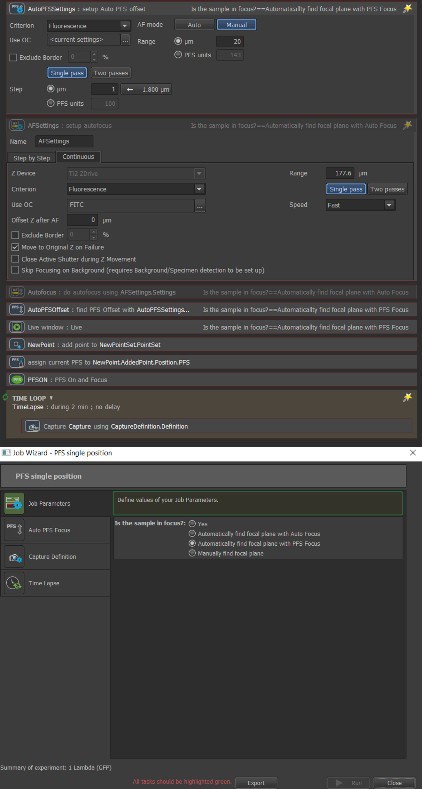
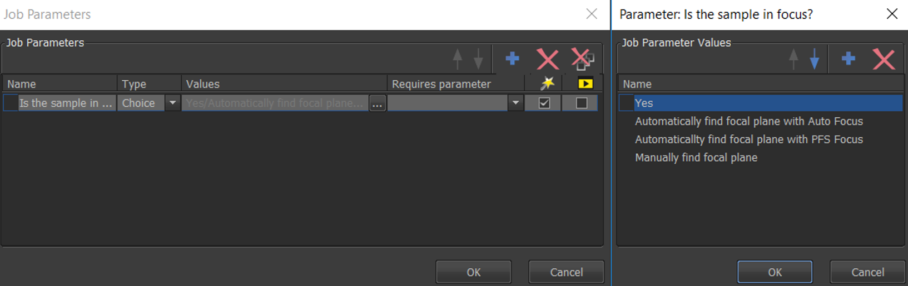
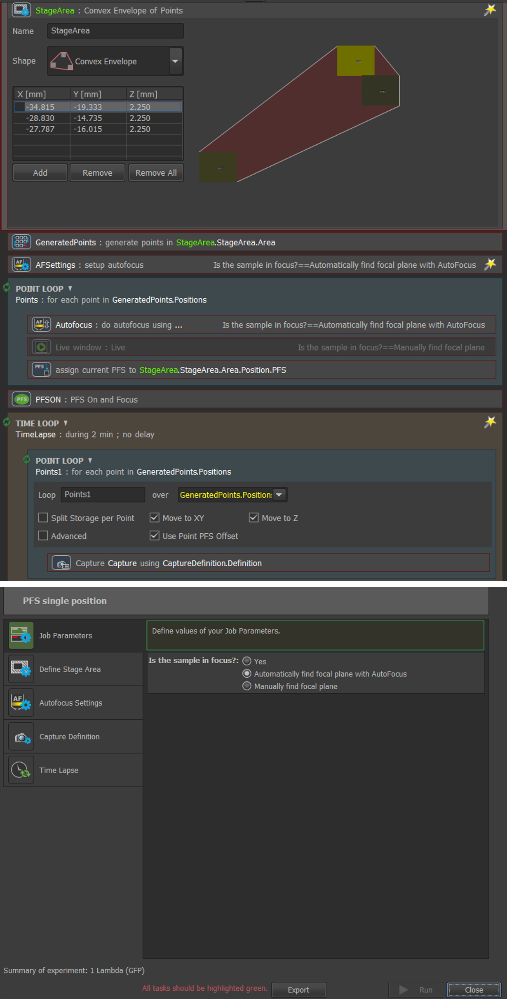
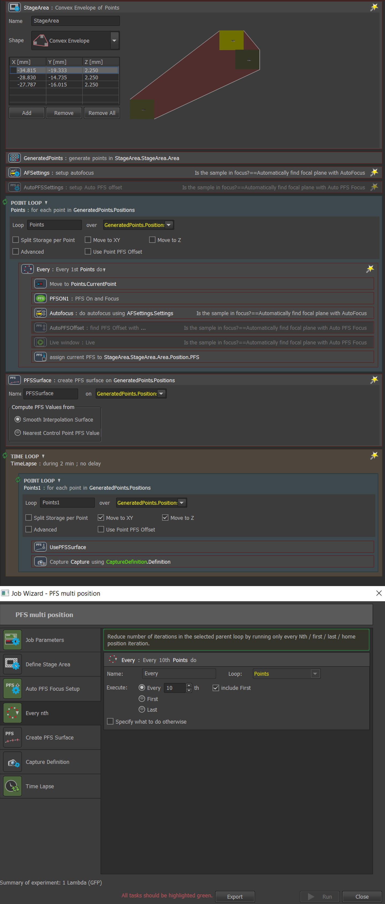

```{r setup, include=FALSE}
knitr::opts_chunk$set(echo = FALSE)
```

Nikon's Perfect Focus System (PFS) is used to prevent z-drift over time, or overcome slight tilting in the sample when imaging multiple XY positions. Before using the PFS it is useful to understand how it maintains the distance between the objective and the sample. See the [microscopyU article](https://www.microscopyu.com/tutorials/the-nikon-perfect-focus-system-pfs) for a more detailed description, and interactive tutorial.


Within the JOBs module there are 9 different PFS tasks that can be dragged and dropped when creating a pipeline. The Help file within Elements (Top menu > Help > Contents) has a thorough description of what each of these tasks does, and the relevant menu can be navigated to by following the  NIS-Elements AR > Additional Modules > JOBS and HCA > Task reference > PFS direcrtory path.


## 1. Find focal plane and image single XY position over time

Figure 1 shows a JOB that will set the correct PFS offset, and turn the PFS on at the sample focal plane before acquiring a time-lapse experiment. 

```{r, fig.cap =  "Using PFS to image single XY position over time", layout="l-body-outset"}



```

The JOB contains parameters that provide the user options within the wizard to find the focal plane using the software based autofocus routine, with the optical PFS, or manually find the focal plane using a live image acquisition and turning the z wheel (Figure 2).  

To access the parameters within JOBs, you must select to show parameters within the settings option from the JOBs definition window. Once you have added the parameter (Figure 2), you can set specific tasks to require the relevant parameter by right cliking on the task within the JOBs definition window.

```{r, fig.cap =  "Defining parameters within JOBs that provide users with options within the wizard", layout="l-body-outset"}



```

The Auto PFS is very similar to the software based AutoFocus with the difference that the result of Auto Focus stones a Z-position for the Z-drive to return to, while the result of Auto PFS Focus is the PFS Offset value. In some instances it may be faster, or more favourable to use one over the other. 

The assign PFS offset to current position task is quite self explanatory, but does require you to add a new point set beforehand so it has somewhere to save the PFS offset value. 

Once in focus, the PFSON task turns the Perfect Focus System (PFS) on and attempts to find the existing PFS offset. There are options to choose from if the PFS fails to find the offset, this will happen if the z position is too far away from the PFS offset. Either another Auto focusing routine can be implemented, or the Z stage can be moved up/down by a specified value.


## 2. Image multi-poisitions where sample is differs in its distance from coverslip

PFS is useful for imaging multiple XY positions. By maintaining the distance between the objective and the sample, it automatically corrects for samples that are tilted in their holder, or slight variations in the manufacture of sample holders.  

If the sample is always the same distance from the coverslip, then only one PFS offset is required for multiple XY stage positions. However, if the sample varies in its distance from the coverlsip at different XY positions, then separate PFS offsets will need to be set.

Figure 3 shows a JOB that, before imaging, moves the stage to each point in the defined stage area (using a Point Loop), auto-focuses (or allows the user to focus manually), and when in focus, sets the z position as the PFS offset for that particular point using the Task 'Assign PFS to Point/Well'.


```{r, fig.cap =  "Setting individual PFS offsets for each XY stage position", layout="l-body-outset"}



```


## 3. PFS focus surface 

If the sample to be imaged is very large and/or the objective magnification very high, the number of stage positions required to cover the whole sample may be very large. It may be very time restrictive to move the stage to each position to find the PFS offset before imaging.  

Another option is to use the PFS focus surface to interpolate the PFS offset between regularly sampled positions.  

There is already a nice guide on how to create a PFS focus surface within the NIS-Elements Help menu (NIS-Elements AR > Additional Modules > JOBS and HCA > Use Cases). As this was designed for wellplates, we will show how you would implement this feature for a multi-poisition sample of a slide.


```{r, fig.cap =  "Creating PFS surface to interpolate between the varying PFS offsets over different XY stage positions", layout="l-body-outset"}



```


## Acknowledgments {.appendix}


https://www.microscopyu.com/tutorials/the-nikon-perfect-focus-system-pfs


