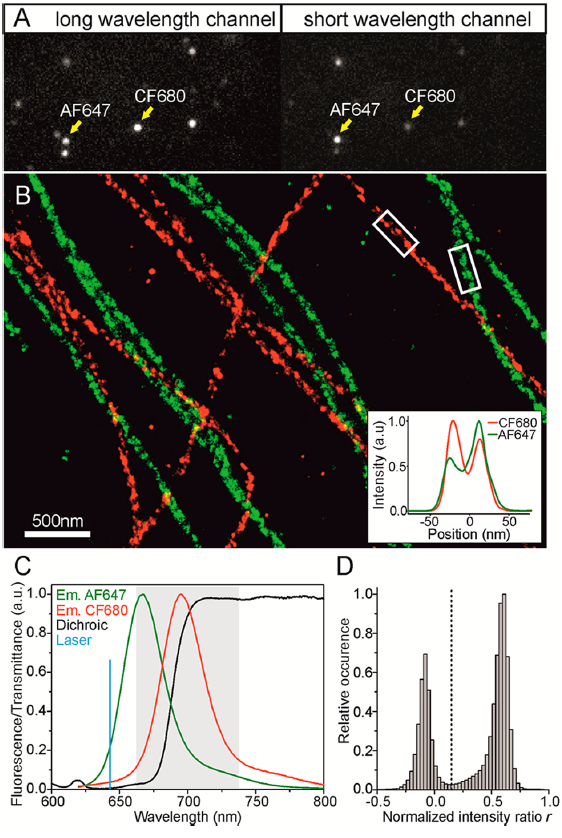
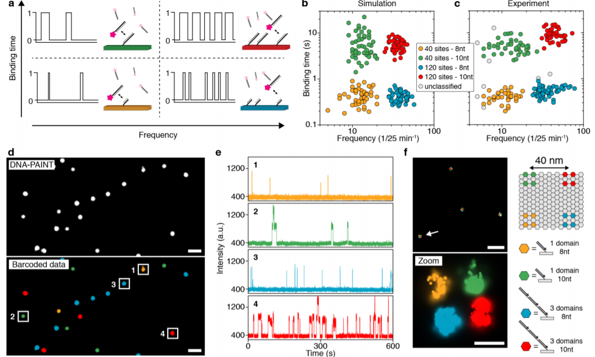

```{r setup, include=FALSE}
knitr::opts_chunk$set(echo = FALSE)
```

An excellent place to start for those who wish to multi-colour STORM/SMLM experiments is the [detailed post](https://www.aicjanelia.org/post/multi-color-single-molecule-localization-microscopy) by Jesse Aaron at the AIC, Janelia Farm on how best to select probes for multi-color SMLM.


When I initially read this my feeling was that the best approach they suggested was to label one protein with Alexa-647, image, strip the sample of antibody labels using NH4CL, and then label a second protein with a Alexa-647 conjugated antibody. From what I gather no other dye provides anywhere near the localisation accuracy of Alexa-647. This method also removes the issue of bleaching fluorophores that are to be imaged second with the high laser powers required to image the first fluorophore.  

Obviously, quenching and re-labeling takes time, and you need a very stable system to be sure the sample has not moved during quesnching, and labelling. Since I first read Jesse's post, I have come across a few other options, which provide more elegant solutions, and if proove viable should take much less time.

## Co-label samples with Alexa 647 and CF 660. 

Both probes can be excited by ~ 640 nm lasers, thereby avoiding issues of bleaching one-another. CF 660 also has excellent blinking properties to rival Alx 647. To separate their emission spectra, Platanova et al., use a 685 nm long pass dichroic, and image simultaneously onto 2 cameras. The technique is described in detail in the link below:

https://doi.org/10.1021/acschembio.5b00046  


```{r, fig.cap =  "Alx647 and CF680 are distinguishable by their relative brightness", layout="l-body-outset"}



```


## A simultaneous multiplexed variant of DNA-PAINT.   

Usually DNA-PAINT experiments take ages because of all the separate perfusions required. However, by changing the length, and number of binding sites on DNA oligomers Ralf Jungmann's lab were able to  distunguish 124 different oligomer-bound proteins when applied simultaenously to the same sample.  


This was achieved using a very clever approach of designing oligomer's with different numbers of binding sites and different lengths to adjust the duration the oligomers bind to thier target. By designing oligomers for different targets with sufficiently different binding properties, Wade et al, were able to distnguish a vast number of different single moelcules. In their paper they conjugated their DNA oligomers to Cy3.  
https://doi.org/10.1021/acs.nanolett.9b00508

```{r, fig.cap =  "Designing oligomers with different binding sites and nucleotide lengths allow for targets to be distinguished by their blinking frequency and duration", layout="l-body-outset"}



```


There is company called [Massive Photonics](https://www.massive-photonics.com/) based in Germany, which has now taken the mantle (previously held by Ultivue) to make dye-labeled DNA oligomers.

The multiplexed DNA-PAINT approach will no doubt be aided by the finding from a recent pre-print that using left-handed DNA oligomers, instead of the usually employed right-handed oligomers, markedly reduced the stickiness of DNA-PAINT probes, thereby increasing their specificity.  

https://www.biorxiv.org/content/10.1101/2020.03.28.010553v1


## Acknowledgments {.appendix}

Thanks to Dr Ben Compans currently at King's College London for making me aware of the Alexa647/CF660 paper.

Preview image taken from "N-STORM with DNA-PAINT for Reliable Multicolor & 3D Single Molecule Localization Imaging" application note written by John R. Allen at Nikon in 2016. https://www.microscope.healthcare.nikon.com/products/super-resolution-microscopes/n-storm-super-resolution/application-notes


