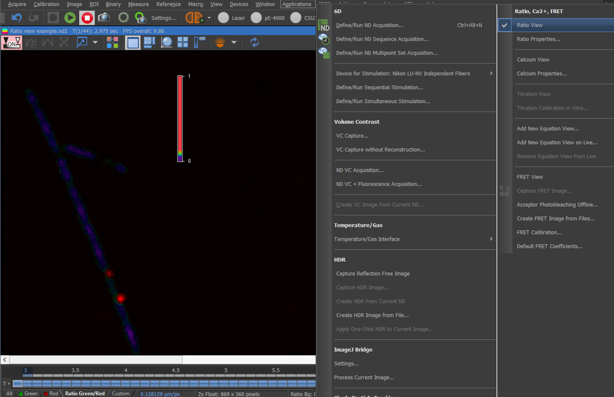
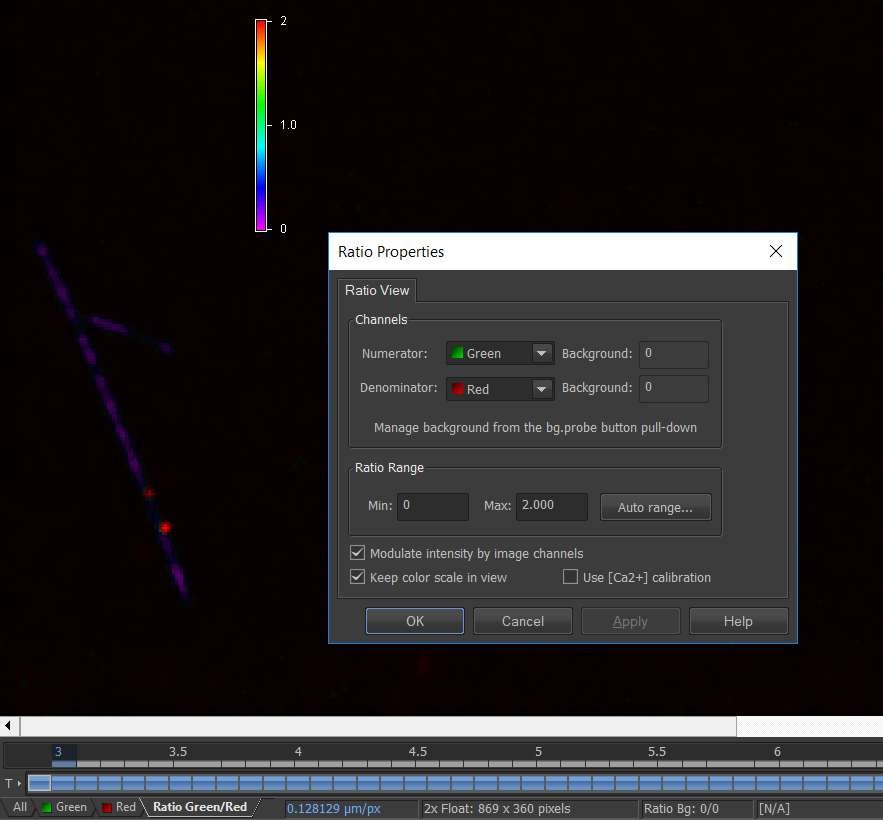
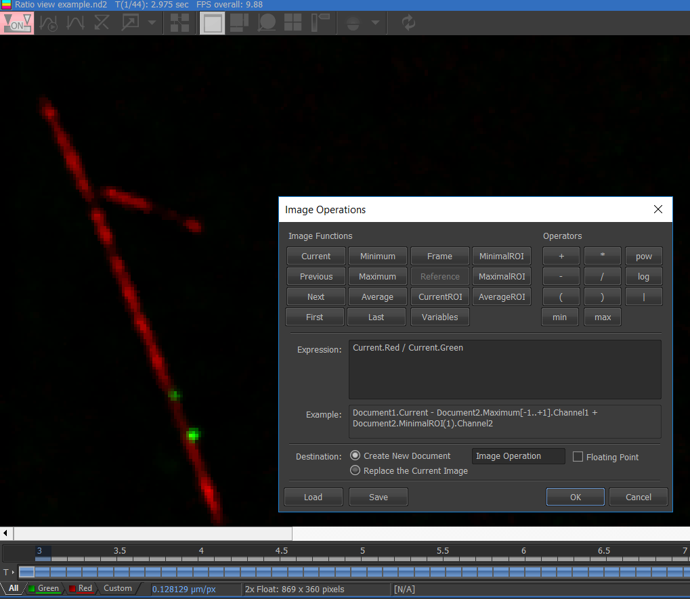

```{r setup, include=FALSE}
knitr::opts_chunk$set(echo = FALSE)
```

For those who wish to use NIS-Elements to calculate the ratio of one fluorophore to another per pixel, and display these values as a Ratio image they have two options:


## Ratio View


If the NIS-Elements license you are using has the FRET module then the user simply navigates to Applications menu > Ratio view. This will create a new channel in the bottom left of the image document.

```{r, fig.cap =  "Ratio View mode showing additional channel in image document ", layout="l-body-outset"}



```

The ratio scale bar can be displayed, or hidden by right clicking on the image document. In addtion to Ratio View channel can be toggled off and on by right clicking on the image document and selecting 'Ratio View'.


The settings for how this Ratio View  is calculated can be adjusted from the Applications > Ratio Properties interface:

```{r, fig.cap =  "Ratio View options", layout="l-body-outset"}



```


* Numerator/Denominator options define the image channels from which the ratio will be counted from. The image channels from the current image can be selected.

* The background option gives the user the ability to  The offset value is subtracted from the corresponding channel before the ratio will be counted.


* The Minimum/Maximum option allows the user to define the range displayed on the ratio colour scale. The user can input their preferred values, or use the Auto Range button to fill them automatically. 


* The Modulate intensity by image channels check box allows the user to show the ratio modulated by the average intensity of the selected channels. The user can switch the modulation off and display the raw ratio of two selected channels.


* Keep Color Scale in View option keeps the ratio colour scale bar in view when the image is zoomed in.


## Image Operations

For those with an NIS-Elements license that does not include the FRET module then it will not be possible to use the Ratio View option above. Instead they will have to use the Image Operations window, which is selectable from the Image menu > Image operations. The following window will appear:


```{r, fig.cap =  "Creating a ratio channel using Image Operations window", layout="l-body-outset"}



```

Simply select " Current " and choose the numerator channel from the current image document (in this example, the Red channel). Then select the " / " divide operator from the left hand side, and the select the " Current " option again, this time selecting the denominator option (in this case the Green channel). When the user presses Ok, a new Image document will appear. 

\
To get this ratio view into the same ND image document as the raw single channel images, then the user can drag the "Image operation" tab in the newly created image, into the original ND image document containing the individual channels. The individual and ratio view images will then appear side by side in the original ND image document. 


