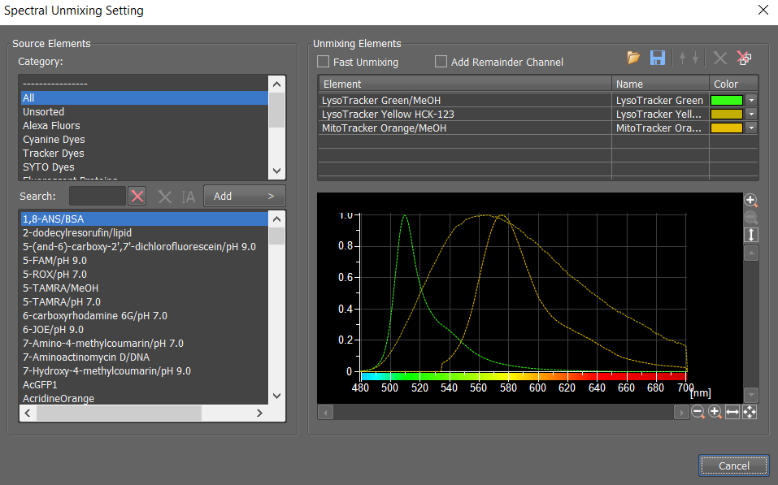
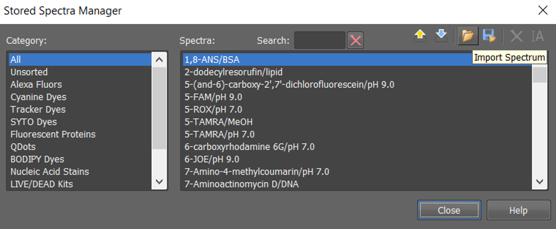
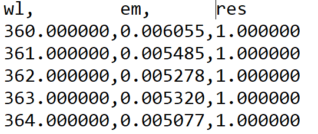
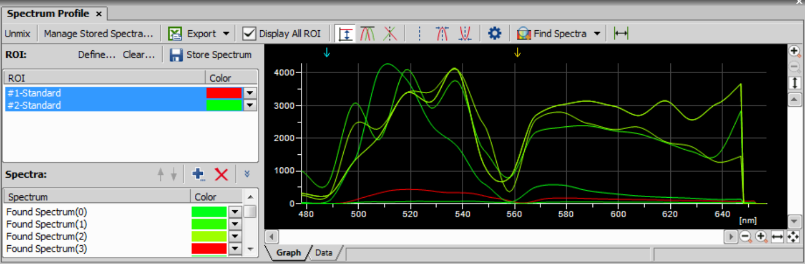
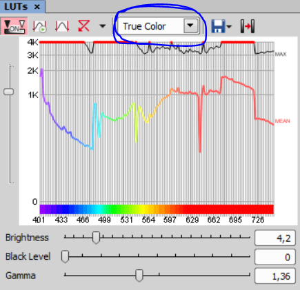

```{r setup, include=FALSE}

knitr::opts_chunk$set(echo = FALSE)

```


## Spectral Unmixing Settings

Once you have acquired your image that requires spectrally unmixing navigate to Image > Spectral Unmixing Settings

Select the fluorophores in your image from the spectra listed in the 'Source Elements' portion of the window. Selecting the appropriate fluorophore and pressing 'Add' will transfer the spectra to the 'Unmixing Elements' section of the window. Once you are happy with the fluorophores then close the settings window. The settings will be preserved until changed. 

Combinations of fluorophores to be spectrally unmixed can be saved to an XML file and reloaded to save time between sessions.

The following options are available  :

- The name and psuedo-color of each fluorophore can be adjusted by clicking inside the table. 
- Fast Unmix performs simplified unmixing if speed is desired over quality for demanding unmixing processes.
- A remainder channel can be added that adds the deviation data to the resulting image. This generally refers to autofluorescence, or other sources of fluorescence light not associated with the listed fluorophores in the 'Unmixing Elements' portion of the Spectral Unmixing Settings. It is displayed as a separate channel in the unmixed ND2 image document. The remainder channel does not count as a classification


```{r, fig.cap =  "Spectral Unmixing Settings", layout="l-body-outset"}



```

If the database of fluorophores does not contain the spectrum you are interested in, then user defined spectra can be manually loaded from a text file within Image > Manage Stored Spectra window. Once imported they will appear in the 'Source Elements' portion of the Spectral Unmixing Settings GUI.

```{r, fig.cap =  "Importing user defined spectra using Manage Stored Spectra Window", layout="l-body-outset"}



```

The text file should have the following format

```{r, fig.cap =  "Format of text files to import user defined spectra", layout="l-body-outset"}



```

If region of interests are defined, the image information from within the ROI can be used as a reference spectra separate from the whole image spectra. Within the 'Source Elements' portion of the window select the ROIs category, and the actual ROI.


## Viewing and Unmixnig the spectra within an image

The Spectrum profile: 

- Plots the relative intensities vs wavelengths in your image. It does this on the whole image, but will display the spectrum within a ROI if drawn. The spectral information can be displayed for multiple ROIs simultaneously. 

- Allows the user to compare the spectra in their image to a library of known fluorphore reference spectra. This allows the user to see how their unknown spectra compares to known fluorophores. Reference spectra can be added to the graph for comparison from the 'Spectra' portion of the window.

```{r, fig.cap =  "Spectrum profile viewer", layout="l-body-outset"}



```

Scaling of the spectrum profile y-axis is flexible:

- Absolute intensities
- Relative intensities that sets the peaks to the same size, which can be useful when some spectra are relatively dim.
- Scale to cursor, which scales the spectra y-axis on the position where the user places the cursor on the graph. 

The mouse wheel to zoom in to specific regions of the graph.

The little arrows at the top of the screen indicate where the laser excitation blocking finger are located in the acquisition. You can right click on this, and use trend style to smooth the graph and smooth the blocking fingers out if you want to. 


The Unmix button will perform the spectral unmixing based on the Spectral Unmixing Setting, and create a new unmixed ND2 image document.


## Spectral LUTs

The graph inside the LUTs window shows intensity values on the Y axis and wavelength spectra on the X-axis. There are two curves in the graph. The top (white) curve displays the maximal intensity, and the colour curve displays the mean intensity of each channel.

```{r, fig.cap =  "Spectral Lookup Tables", layout="l-body-outset"}



```

The LUTs display can be selected the from the pull-down menu in the LUTs toolbar (blue circle):

- True Colour: Pseudo-colour based on the wavelength 
- Custom Colour:  You can assign custom colors to sections of the spectrum. Sections (colors) can be added/removed by clicking the + and - buttons placed below the spectral graph. To change the section color, click the button located in the color stripe.
- Grouped: allows you to group wavelengths together in bands.
- Gray Scale


