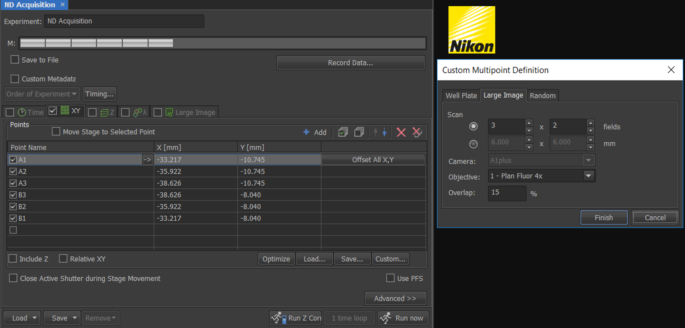

```{r setup, include=FALSE}
knitr::opts_chunk$set(echo = FALSE)
```

## Different ways to acquire large image

Within NIS-Elements there are a few ways to capture large images  

**1. ND acqusiition**


```{r, fig.cap = "ND acquisition has a Large image tab that automatically creates a stitched image", out.extra="class=external", layout="l-body-outset"}


```

**2. Scanning wizard**


From version 5.10.00 onwards there is the option to use the scanning wizard from the Addons menu. This feature is in effect a wizardised JOB, and allows bespoke stage areas such as polygons or convex hulls to be defined by moving the stage to your specimen boundries and adding stage coordinates.  

```{r, fig.cap = "Scanning wizard provides the user the ability to define a bespoke large area to scan", out.extra="class=external", layout="l-body-outset"}


```

**3. ND acqusiiton XY points with custom large image definition selected**

Alternatively, you can acquire multi-position XY images (with an overlap but no stitching), and choose to stich them together afterwards. This is usually recommened as the raw, non-stitched, images are preserved. 


```{r, fig.cap = "By using the custom option in the XY tab of ND acqusition the user can preserve the raw, non stitched images, which can be stitched post-acquisition", out.extra="class=external", layout="l-body-outset"}



```

Following acquisition of the XY multi-points, the user can stitch the image together using the option in Image > ND processing > Stitch multipoints to large image. 

```{r, fig.cap = "Post-acquisition image stitching GUI", out.extra="class=external", layout="l-body-outset"}


```

**4. JOBs option 1**

Whilst the previous method is a good option, you are confined to the rectanglular shapes that can be defined within ND acquisition. To acquire a bespoke shape, and preseve the non-stitched images you will need to use JOBs.  

Below is an example of a simple JOB that allows you to define the bespoke area by moving the stage around your specimen boundry and adding stage coordinates, generate points based on a user-defined overlap percentage, and then exports the stage positions to the XY tab within ND-acquisition.  


```{r, fig.cap = "Use JOBs to define bespoke stage area shape and export stage points to the XY tab of ND acquisition", out.extra="class=external", layout="l-body-outset"}


```

Of course it is also possible to perform this operation completely within JOBs, for instance by implementing capture definition and the capture commands within a point loop.

```{r, fig.cap = "Define bespoke stage area shape within JOBs before using a point loop to acquire the images within the same JOB", out.extra="class=external", layout="l-body-outset"}

knitr::include_graphics("images/JOBs_capture_point_loop.PNG")

```

**JOBs option 2**

What if you do not want to spend time moving the stage around to define your bespoke shape to scan and stitch over?  

A more precise option is to generate a bespoke large image scan and stitch is to perform a quick rectangular large scan with a low magnification objective, draw around the specimen/s, or region of interest/s, with the ROI tools, and then automatically populate the XY tab of ND acquisition with the relevant stage positions given information on the objective to be subsequently used. It is then possible to 

For this, we include a large image rectangular acquisiton scan in the JOB, specifying the number of x and y tiles and the overlap.   


```{r, fig.cap = "A JOB that uses a quick Large image scan and then provides the user the possibility to define the ROI around their specimen ", out.extra="class=external", layout="l-body-outset"}


```


Once generated, a run time stitched image will appear, and the Draw Image command will show the ROI tools that can be used to manually, or automatically detect ROIs. Once happy, pressing the right mouse button, and 'Finish' within the ROI tools will generate the stage positions based on the Generate Points command, using the objective an the % overlap specified. In this istance the stage positions are exported to ND acquisiton where the bespoke large image scan can be captured. 


```{r, fig.cap =  "The JOB gives the option to define ROIs around the sample/s, from which stage positions are generated", out.extra="class=external", layout="l-body-outset"}

knitr::include_graphics("images/Draw_regions.PNG")

```


As with the previous JOB, it is possible to perform the bespoke large image scan and stitch within JOBs if preferred.  


## Image stitching options

Within NIS-Elements there are two options for stitching images together. The blending algorithm  overlays the two images, and blends the pixels together. This option will change the pixel intensities in the overlapped region from their raw form. 

Alternatively, you can use the 'Optimal path' method where a contour is generated depending on where the two overlapping images are least different. The images are then stitched according to this contour, taking some pixels from one image, and other pixels from the other. In this way the pixel intensities are preserved from their raw acquired state.

Before NIS-Elements version 5.20, we would recommend the blending method, as the results were consistently better. However, with improvements to the optimal path algorithm, we now highly recommend using the Optical path option.


## Multi channel image stitiching

If you acquire a multi-channel image, what channel does the image stitching algorithms use?  

Registration, or the alignment of tiles, is done on the combined information from all channels. Stitching, and blending, is always done at once for all channels so that the seams are identical for different channels.  


## Shading correction

What channel is used for shading correction in a multi-channel image within NIS-Elements?  

The shading correction is calculated for all channels separately. The background fluorescence can vary between the channels so we do not support using shading estimates from one channel to correct another one. For RGB images, it is done at once for all three channels from the calculated intensity.  

Note, there are some algorithmic changes in more recent versions of NIS-Elements that have improved the results.

For suggestions on to impletment shading correction into your imaging, Kurt Thorn wrote a [handy blog post](href: Useful_links.html)


## Background subtraction

Background subtraction performs a subtraction, not a division. Division is possible using the Image > Image operations menu.


## Acknowledgments {.appendix}

As always the searchable help file in NIS-Elements has helped in writing this post.  

I was made aware of the Large image scan + draw regions JOB by Ingo Ohlenschlaeger an advanced imaging specialist for Nikon Austria.


In addition I was informed by the improvements to the optimal path improvements by the team at Laboratory Imaging, and recently reminded by Michael Juniper, also an advanced imaging specialist fro NIKON UK


