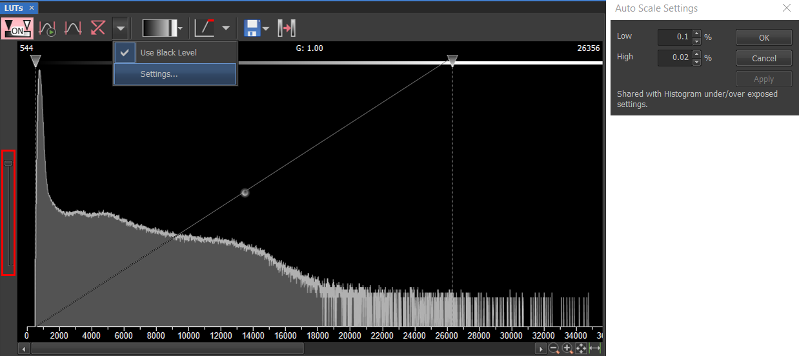

```{r setup, include=FALSE}

library(knitr)

knitr::opts_chunk$set(echo = FALSE)

```

## Magnifier glass

A tool that is quite simple but very useful. Allows users to quickly zoom anyware on an image. Select the magnifying glass from the left toolbar, and click and hold the left mouse button inside your image. 

You can define the zooming parameters to your own preference by going to View > Magnifier Glass Options. By default the magnifier glass is set to 300% in a circle shape as shown below

```{r, layout="l-body-outset"}


```

## Quick context menu

When you press and hold the secondary mouse button over a displayed image for a longer time than feels natural, the quick context menu will appear. Basic tools for detecting, drawing, and deleting ROIs, clearing binaries, and adding annotations are already predefined. 

You can customise these tools within the Quick Context Menu tab in the general options window (Run Edit > Options ). Up to 8 predefined options can be defined. 

By utlising this menu effectively, the binary and ROI options on the right side of the image window can be removed (using Edit > Options > Layout Manager), thereby simplifying the display.  

```{r, layout="l-body-outset"}


```

## Close all buttons

It is very easy to generate many images during an imaging session, not all of them you will want to keep. Having quick buttons on the toolbar to close all windows reduces time spent closing each one individually. 

Buttons can be added using the Layout Manager (Edit > Options > Layout Manager). Select the toolbar in the layout you're interested in and add a button by selecting Add > Command. Note, the Global toolbar will add the button to every layout. 

In this case the command you will need to add in the Button properties section is "_CloseAllDocuments();", which can be selected from the command list using the dropdown menu next to the command text box. To add a picture to your button so it can be easily identified, you will need to select the "Change" in the Enabled bitmap section, from which you can select from a range of bitmap images. 


```{r, layout="l-body-outset"}


```

A slight variation on the above is to close all images but the one currently selected. The same procedure as above is followed, expect the command required is "_CloseAllDocumentsButCurrent();" 


```{r, layout="l-body-outset"}


```

## ND information

Another tool that is quite hidden away is ND information. This feature allows the user to label their images with metadata such as acquisition time, or the x, y or z position acquired. For time-lapses or z-stacks this can be very useful. 


```{r, layout="l-body-outset"}


```

To show image metadata right click on an image just once, and in the menu, select 'Show ND information'. From the following menu you can select what meta data to show, and change the font properties as you wish.


```{r, layout="l-body-outset"}


```


## Keyboard shortcuts

Keyboard shortcuts are particuarly useful when doing tasks that are reptitivie or need doing quickly. This often occurs when setting up an imaging experiment. There are many keyboard shortcuts in NIS-Elements. Though its difficult to memorise them all, below is a list of what I think are the most useful. 

* '+' : Play or live image
* '-' : Freeze or stop live image
* 1 : Zoom in on image window to 100% (1:1)
* 2 : Change zoom of image window to fit image within window
* I : Bring up image properties menu with all the metadata 
* Q : Brings up the Options menu


## Adjusting  Auto-LUT default settings 

When using NIS-Elements you will frequently use the Auto-LUT button to automatically adjust the cursor positions of all channels in your image. The purpose is to resonably enhance the image that is displyaed on screen by filtering the pixels based on their intensity. Note the pixel values are not changed, just which pixels are displayed.

By default the settings are low: 0.01, high: 0.1. By changing them to low: 0.1, and high: 0.02, I find I get a much better range of pixel intensities. The image below shows how to change the settings:  

```{r, layout="l-body-outset"}



```

Another slightly hidden feature in the LUT window is the slider on the left (inside the red box). This slider changes the count scale of the histogram from linear to logarithmic. By default it is always set to linear, though I personally prefer to see the logarithmic view as you can see the high intensity pixels more clearly. 


