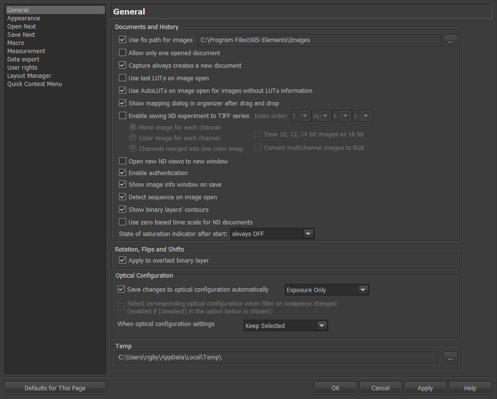
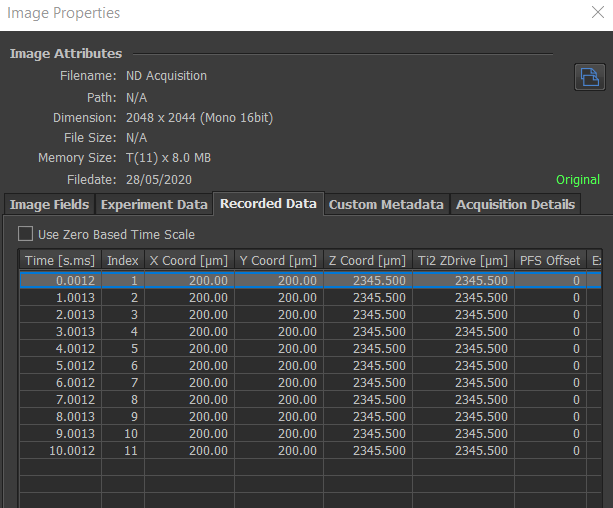

```{r setup, include=FALSE}
knitr::opts_chunk$set(echo = FALSE)
```


## General

The General options within NIS-Elements can be accessed by selecting the blue cog button on the left toolbar, by the keyboard shortcut 'Q', or through the Edit > Options menu.  


The following window will appear with a list of options  


```{r, layout="l-body-outset"}



```


### Documents and History
- Use fixed path for images 
Its strongly recommended to change path to a sensible location where the majority of images are saved to. When users select 'Open', they will be directed to a parent folder to where there images are likely saved, rather than a random C drive location as is the default.  

- Allow only one open document  
I never check this option, I'm not sure why people would want to.

- Capture always creates a new document   
I tend to check this. Unchecking with add each consequetively captured image to the same document.


- Use last LUTs on image open  
When taking many consequeitve images this option saves the user time adjusting the LUT each time. I tend to have this option checked.


- Use AutoLUTs on image open for images without LUTs information  
This is a good option to check so that when you open an image, it doens't look completely black

- Show mapping dialog in organizer after drag and drop  
Keep checked

- Enable save image to tiff   
This option saves images as tiff files as they are acquired, which means they are recoverable if a crash or power outage occurs (not that Elements ever crashes!). Normally, nd2 files are stored in a temp folder as they are acquired, and are not saved if the system crashes.  
Once enabled, if you do want to save the images as Tiff you will need to check the box 'save as tiff series' within ND acquisition before acquiring the images (shown below).

```{r, layout="l-body-outset"}


```


- Enable authentication   
This is a nice feature which watermarks images for authentication that they have not been modified from the original. I.e. no processing has been performed. The watermark is visible in the image metadata as show by the 'original' text (below).  


```{r, layout="l-body-outset-outset"}



```


- Use zero based time scale for ND documents   
I generally like to check this box.  

### Rotataion, Flips and Shifts
- Apply to overlaid binary layer   
I dont know of many situations where you would not want to have this option selected.  


### Optical configuration
- Save changes to optical configuration automatically  
I always select 'Exposure only' in this case, esepcially if its a multi-user system. Automatically saving camera settings ot brightness settings (illumination power or gain) can be dangerous if other users are not aware they have been changed.  

- Select corresponding optical configuration when filter or nosepiece changed  
This is a very useful feature that not many people use. It basically means that if you are toggling between filter cubes, Elements will change the OC to best match the change you have made.  


### Temp
- Temp folder: I strongly advice users to change this from the default C drive to the  data drive they have the largest space on. Nd2 files are saved to the temp folder during acquisition, and if its an over-night time lapse with lots of data this could quite easily clog up the C drive and reduce the perfromance of the system. The best solution is to change the temp folder destination to a fast ssd drive, this will also act to speed up processing, particularly large image stitching.


## Appearance

I do not tend to change the appearance settings too much from default, below are the few I do like to change.


```{r, layout="l-body-outset-outset"}


```

### General

- Background  
I personally find the tiled background with the circular image very messy. I tend to change this to a solid block colour, mostly a grey slightly different to the grey used in the dark colour scheme.

- Colour scheme  
I tend to prefer the dark scheme, thoguh for training the light scheme can often be easier for groups to see.


### Multiple windows
 - Keep picture window aspect  
 I always uncheck this, if checked the windo size will change as you are zooming, which I find quite irritating.
 
 - Initial zoom 100% for live and capture  
 I prefer to keep this checked, if not then whatever the zoom is for the last live or captured image will be presered in the next.
 
 
### 3D rendering
- This is used for the 3D volume viewer which is included with every copy of NIS-Elements AR and works very nicely, especially for making rendered movies. By default it should be set to the New Engine, which is much faster than the old engine, but its always worth checking. 
 


