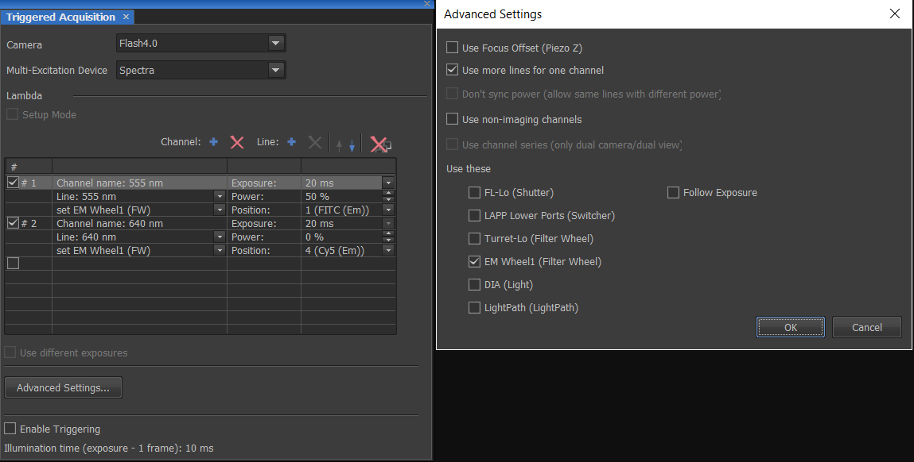

```{r setup, include=FALSE}
knitr::opts_chunk$set(echo = TRUE)

setwd("C:/Users/rigby/Documents/Blog/")

```

<br>

Triggered Acquisition in NIS-Elements allows the user to acquire images where some actions during the acquisition are controlled solely by hardware  without the need for software interference and motherboard processing that can introduce delays. 

Instances when triggered acquisition will be useful:

 * Multi wavelength excitation - where the camera sends signals to an illumination device to switch between wavelength lines, and in some cases triggers an emission filter wheel to move to the correct position. Note, the white LED in the diascopic pillar of the Ti2 can also be triggered.


 * Piezo Z - where a camera triggers the piezo Z stage to move over the specified range.


 * Multi wavelength excitation + Piezo Z - a combination of the above mentioned applications, where a camera triggers both the Piezo Z stage and the wavelength switcher.


In practice NIS-Elements tells the camera to begin acquisition, the camera then takes an image, and at the same time sends a signal to the NiDAQ card in the PC, that via a breakout box tells the LED to turn on, the Piezo to move, and the filter wheel to change position, without communicating back to NIS-Elements.

<br>
<br>

## Advantages of triggering


Typically users can expect to have a large increase in speed of acquisition. The increase in speed will depend on the frame rate of acquisition but as an example if you were to run a camera at its quickest exposure time that it can complete 1 full frame, and acquire 10 frames of 3 channels then the total time of acquisiton is below

- White LED and changing the filter turret cubes = 34 seconds
- Multi-wavelength LED and static quad band filter cube = 25 seconds
- Triggered multi-wavelength LED and static quad band filter cube = 1 second

Another advantage is that since you are using the NiDAQ timing rather than the PC timing, the user will have more precise information on when the images were acquired.


<br>
<br>

## Using the Triggered Acquisition pad

To open the Triggered Acquisition pad, go to View > Acquisition Controls > Triggered Acquisition

<br>

```{r, out.width = "100%", fig.pos="h", message=FALSE, echo=FALSE } 




```

<br>

Make sure the camera and multi-excitation device is populated with the correct devices on your system.

In 'Advanced' window make sure

* 'Use more lines for one channel' is ticked. This will allow you to associate emission filter wheel positions to a Channel, in addition to the excitation wavelength. 

* In the 'Use these devices' section select the devices that you would like to trigger besides the multi-wavelength LED. This may be an emission filter wheel for example, the diascopic LED if wanting to acquire a brightfield triggered image, or the filter turret if there is too much bleedthrough in the multi-band filter cube. Please refer to the Ti2 pad to help you differentiate between the filter turret and filter wheel.


Back in the main Triggered Acquisition window Press + Channel to add a channel wavelength to the table, and select the approproiate line. If another device is to be triggered, then select '+ line' and from the drop down box select the device, and in the corresponding position cell select which filter position (Emission filter wheel, or Filter turret), or state (Diascopic LED) is to be used.

For each channel the power can be specified. The power refers to the percentage of the total power (%) of the LED or lasers to be used during acquisition. There is also an option for the exposure that refers to the exposure time of the camera, note the exposure time cannot be different for different channels, unless specific cameras that allow this feature are used.

The 'Enable Triggering' check box will allow you to turn the triggering ON and using 'Setup mode' you can run a Live Image and you can test each channel independently to make sure you are capturing what you are expecting to see.

<br>
<br>

## Creating Optical Configurations for Multi-channel Triggered Acquisition

There are two ways to create an optical configuration containing a triggered-acquisition recipe.


### 1. Using the Triggered Acquisition Panel

<br>

1. Run the View > Acquisition Controls > Triggered Acquisition  command to display the panel.


2. Select devices for triggering and define the acquisition channels (see above). Select the Enable Triggering check box.


3. Run Calibration > New Optical Configuration and select to include Camera setting in the configuration.  

<br>


### 2. Using the Optical Configurations Window

<br>

1. Run the Calibration > Optical Configurations command.


2. Create one optical configuration for each channel. Make sure the Camera setting and Microscope setting options are selected to ensure that settings of the camera and the triggered device are included.  


**Caution** The Enable Triggering check box in the Triggered Acquisition window must not be selected.


**Caution** If the configurations contain also settings of devices which cannot be triggered (e.g. certain filter wheel models), the acquisition sequence will be created anyway, but the state of the filter wheel defined in the first optical configuration will be used throughout the whole sequence.  


3. Select all optical configurations which are intended to compose the triggered acquisition sequence (hold the Ctrl key).


4. Click the Merge to TA button to create the optical configuration.  


With the second option of Merging to TA, please check the different Channels and Lines are what you are expecting in the Triggered Acquisition pad.


## Acknowledgments {.appendix}


The help file in NIS-Elements provided the basis of much that was written. 

